Employee Performance Analysis
================
Alexander Wanstrath
2025-10-07

# Load Packages

``` r
# Load packages
library(tidyverse)
library(stargazer)
library(ggthemes)
library(haven)
library(skimr)
library(labelled)
library(infer)
library(janitor)
library(lubridate)
library(corrr)
library(ISOweek)
library(GGally)
```

# Load Data

``` r
## --- Load Data ---

# Load Stata files (place them in a folder called data/)
attitude_labeled <- read_dta("data/attitude_labeled.dta")
endperiod_outcomes_labeled <- read_dta("data/endperiod_outcomes_labeled.dta")
performance_labeled <- read_dta("data/performance_labeled.dta")
summary_volunteer_labeled <- read_dta("data/summary_volunteer_labeled.dta")
wage_new_labeled <- read_dta("data/wage_new_labeled.dta")

# Check if Tables are tibble
is_tibble(attitude_labeled)
```

    ## [1] TRUE

``` r
is_tibble(endperiod_outcomes_labeled)
```

    ## [1] TRUE

``` r
is_tibble(performance_labeled)
```

    ## [1] TRUE

``` r
is_tibble(summary_volunteer_labeled)
```

    ## [1] TRUE

``` r
is_tibble(wage_new_labeled)
```

    ## [1] TRUE

# Data Cleaning

## Attitude

### Pre-Analysis

``` r
glimpse(attitude_labeled)
```

    ## Rows: 2,379
    ## Columns: 5
    ## $ personid   <dbl> 4122, 4122, 4122, 4122, 4122, 4122, 4122, 4122, 4122, 4122,…
    ## $ year_week  <chr> "202249", "202250", "202251", "202252", "202253", "202302",…
    ## $ exhaustion <dbl> 9, 8, 8, 6, 12, 12, 12, 12, 10, 12, 11, 12, 12, 12, 14, 12,…
    ## $ negative   <dbl> 20, 21, 20, 17, 19, 18, 20, 16, 18, 24, 18, 19, 20, 19, 18,…
    ## $ positive   <dbl> 20, 25, 24, 22, 19, 19, 19, 22, 20, 23, 23, 22, 22, 24, 23,…

``` r
skim(attitude_labeled) 
```

|                                                  |                  |
|:-------------------------------------------------|:-----------------|
| Name                                             | attitude_labeled |
| Number of rows                                   | 2379             |
| Number of columns                                | 5                |
| \_\_\_\_\_\_\_\_\_\_\_\_\_\_\_\_\_\_\_\_\_\_\_   |                  |
| Column type frequency:                           |                  |
| character                                        | 1                |
| numeric                                          | 4                |
| \_\_\_\_\_\_\_\_\_\_\_\_\_\_\_\_\_\_\_\_\_\_\_\_ |                  |
| Group variables                                  | None             |

Data summary

**Variable type: character**

| skim_variable | n_missing | complete_rate | min | max | empty | n_unique | whitespace |
|:--------------|----------:|--------------:|----:|----:|------:|---------:|-----------:|
| year_week     |         0 |             1 |   6 |   6 |     0 |       39 |          0 |

**Variable type: numeric**

| skim_variable | n_missing | complete_rate | mean | sd | p0 | p25 | p50 | p75 | p100 | hist |
|:---|---:|---:|---:|---:|---:|---:|---:|---:|---:|:---|
| personid | 0 | 1 | 33005.05 | 10331.78 | 4122 | 26328 | 36288 | 40456 | 45442 | ▁▂▃▃▇ |
| exhaustion | 0 | 1 | 8.61 | 7.79 | 0 | 2 | 7 | 12 | 36 | ▇▅▂▁▁ |
| negative | 0 | 1 | 16.65 | 6.85 | 8 | 11 | 16 | 21 | 40 | ▇▇▅▁▁ |
| positive | 0 | 1 | 24.21 | 6.67 | 8 | 20 | 24 | 29 | 40 | ▁▃▇▅▁ |

``` r
stargazer(as.data.frame(attitude_labeled), type = "text")
```

    ## 
    ## ===================================================
    ## Statistic    N      Mean     St. Dev.   Min   Max  
    ## ---------------------------------------------------
    ## personid   2,379 33,005.050 10,331.780 4,122 45,442
    ## exhaustion 2,379   8.612      7.794    0.000 36.000
    ## negative   2,379   16.651     6.848    8.000 40.000
    ## positive   2,379   24.215     6.668    8.000 40.000
    ## ---------------------------------------------------

### Data Manipulation

``` r
# Save labels
labels_attitude_labeled <- var_label(attitude_labeled)

## Change values into negative values in column negative
attitude_labeled <- attitude_labeled %>%
  mutate(negative = if_else(negative > 0, -negative, negative))

# restore labels
var_label(attitude_labeled) <- labels_attitude_labeled

# delete on same personid and year_week
attitude_labeled <- attitude_labeled %>%
  distinct(personid, year_week, .keep_all=TRUE)

### Check if Dataset is clean
skim(attitude_labeled)
```

|                                                  |                  |
|:-------------------------------------------------|:-----------------|
| Name                                             | attitude_labeled |
| Number of rows                                   | 2379             |
| Number of columns                                | 5                |
| \_\_\_\_\_\_\_\_\_\_\_\_\_\_\_\_\_\_\_\_\_\_\_   |                  |
| Column type frequency:                           |                  |
| character                                        | 1                |
| numeric                                          | 4                |
| \_\_\_\_\_\_\_\_\_\_\_\_\_\_\_\_\_\_\_\_\_\_\_\_ |                  |
| Group variables                                  | None             |

Data summary

**Variable type: character**

| skim_variable | n_missing | complete_rate | min | max | empty | n_unique | whitespace |
|:--------------|----------:|--------------:|----:|----:|------:|---------:|-----------:|
| year_week     |         0 |             1 |   6 |   6 |     0 |       39 |          0 |

**Variable type: numeric**

| skim_variable | n_missing | complete_rate | mean | sd | p0 | p25 | p50 | p75 | p100 | hist |
|:---|---:|---:|---:|---:|---:|---:|---:|---:|---:|:---|
| personid | 0 | 1 | 33005.05 | 10331.78 | 4122 | 26328 | 36288 | 40456 | 45442 | ▁▂▃▃▇ |
| exhaustion | 0 | 1 | 8.61 | 7.79 | 0 | 2 | 7 | 12 | 36 | ▇▅▂▁▁ |
| negative | 0 | 1 | -16.65 | 6.85 | -40 | -21 | -16 | -11 | -8 | ▁▁▅▇▇ |
| positive | 0 | 1 | 24.21 | 6.67 | 8 | 20 | 24 | 29 | 40 | ▁▃▇▅▁ |

## Endperiod

### Pre-Analysis

``` r
glimpse(endperiod_outcomes_labeled)
```

    ## Rows: 135
    ## Columns: 4
    ## $ personid       <dbl> 4122, 6278, 7720, 8834, 8854, 10098, 10356, 12426, 1297…
    ## $ promote_switch <dbl> 0, 0, 0, 0, 0, 0, 0, 0, 0, 1, 0, 0, 1, 1, 0, 0, 0, 1, 0…
    ## $ quitjob        <dbl> 0, 1, 0, 0, 0, 1, 0, 0, 0, 0, 0, 1, 0, 0, 0, 1, 1, 0, 0…
    ## $ costofcommute  <chr> "18", "12", "9", "0", "4", "12", "0", "0", "0", "6.00元"…

``` r
skim(endperiod_outcomes_labeled) #  --> n_missing 2 for cost of commute
```

|  |  |
|:---|:---|
| Name | endperiod_outcomes_labele… |
| Number of rows | 135 |
| Number of columns | 4 |
| \_\_\_\_\_\_\_\_\_\_\_\_\_\_\_\_\_\_\_\_\_\_\_ |  |
| Column type frequency: |  |
| character | 1 |
| numeric | 3 |
| \_\_\_\_\_\_\_\_\_\_\_\_\_\_\_\_\_\_\_\_\_\_\_\_ |  |
| Group variables | None |

Data summary

**Variable type: character**

| skim_variable | n_missing | complete_rate | min | max | empty | n_unique | whitespace |
|:--------------|----------:|--------------:|----:|----:|------:|---------:|-----------:|
| costofcommute |         0 |             1 |   1 |  16 |     0 |       33 |          0 |

**Variable type: numeric**

| skim_variable | n_missing | complete_rate | mean | sd | p0 | p25 | p50 | p75 | p100 | hist |
|:---|---:|---:|---:|---:|---:|---:|---:|---:|---:|:---|
| personid | 0 | 1 | 32716.79 | 10835.70 | 4122 | 25913 | 37292 | 40464 | 45442 | ▁▂▂▃▇ |
| promote_switch | 0 | 1 | 0.16 | 0.37 | 0 | 0 | 0 | 0 | 1 | ▇▁▁▁▂ |
| quitjob | 0 | 1 | 0.30 | 0.46 | 0 | 0 | 0 | 1 | 1 | ▇▁▁▁▃ |

``` r
stargazer(as.data.frame(endperiod_outcomes_labeled), type = "text")
```

    ## 
    ## =====================================================
    ## Statistic       N     Mean     St. Dev.   Min   Max  
    ## -----------------------------------------------------
    ## personid       135 32,716.780 10,835.700 4,122 45,442
    ## promote_switch 135   0.163      0.371      0     1   
    ## quitjob        135   0.296      0.458      0     1   
    ## -----------------------------------------------------

### Data Manipulation

``` r
# Save labels
labels_endperiod_outcomes_labeled <- var_label(endperiod_outcomes_labeled)

### only numeric values - change into character

endperiod_outcomes_labeled <- endperiod_outcomes_labeled %>%
  mutate(
    costofcommute = as.character(costofcommute), # convert to character for string cleaning
    costofcommute = if_else(is.na(costofcommute), NA_character_, costofcommute),# replace NA with NA
    costofcommute = na_if(trimws(costofcommute), "-"), # replace - with NA - trimws - removes leading whitespace
    costofcommute = gsub(',','.', costofcommute), # replace ',' with '.'
    costofcommute = parse_number(costofcommute) # extract numbers
  )

### Change to factor and different labels
endperiod_outcomes_labeled <- endperiod_outcomes_labeled %>% 
  mutate(promote_switch = factor(
    x = promote_switch, levels = c(0, 1), 
    labels = c("not promoted", "promoted")
  )) 

endperiod_outcomes_labeled <- endperiod_outcomes_labeled %>% 
  mutate(quitjob = factor(
    x = quitjob, levels = c(0, 1), 
    labels = c("stayed", "quit")
  )) 

# delete duplicates on same personid
endperiod_outcomes_labeled <- endperiod_outcomes_labeled %>%
  distinct(personid, .keep_all=TRUE)

# restore labels
var_label(endperiod_outcomes_labeled) <- labels_endperiod_outcomes_labeled

### Check if Dataset is clean
skim(endperiod_outcomes_labeled)
```

|  |  |
|:---|:---|
| Name | endperiod_outcomes_labele… |
| Number of rows | 135 |
| Number of columns | 4 |
| \_\_\_\_\_\_\_\_\_\_\_\_\_\_\_\_\_\_\_\_\_\_\_ |  |
| Column type frequency: |  |
| factor | 2 |
| numeric | 2 |
| \_\_\_\_\_\_\_\_\_\_\_\_\_\_\_\_\_\_\_\_\_\_\_\_ |  |
| Group variables | None |

Data summary

**Variable type: factor**

| skim_variable  | n_missing | complete_rate | ordered | n_unique | top_counts        |
|:---------------|----------:|--------------:|:--------|---------:|:------------------|
| promote_switch |         0 |             1 | FALSE   |        2 | not: 113, pro: 22 |
| quitjob        |         0 |             1 | FALSE   |        2 | sta: 95, qui: 40  |

**Variable type: numeric**

| skim_variable | n_missing | complete_rate | mean | sd | p0 | p25 | p50 | p75 | p100 | hist |
|:---|---:|---:|---:|---:|---:|---:|---:|---:|---:|:---|
| personid | 0 | 1.00 | 32716.79 | 10835.70 | 4122 | 25913 | 37292 | 40464 | 45442 | ▁▂▂▃▇ |
| costofcommute | 2 | 0.99 | 7.41 | 7.26 | 0 | 2 | 6 | 10 | 55 | ▇▂▁▁▁ |

## Performance

### Pre-Analysis

``` r
glimpse(performance_labeled)
```

    ## Rows: 9,870
    ## Columns: 12
    ## $ personid          <dbl> 4122, 4122, 4122, 4122, 4122, 4122, 4122, 4122, 4122…
    ## $ year_week         <chr> "202201", "202202", "202203", "202204", "202205", "2…
    ## $ perform1          <chr> "-1.14160859584808", "0.414592355489731", "1.0139772…
    ## $ phonecall         <chr> "-1.13219404220581", "0.312170952558517", "1.0971519…
    ## $ phonecallraw      <chr> "223", "499", "649", "709", "403", "760", "268", "73…
    ## $ homethatweek      <dbl> 0, 0, 0, 0, 0, 0, 0, 0, 0, 0, 0, 0, 0, 0, 0, 0, 0, 0…
    ## $ logphonecall      <chr> "5.40717172622681", "6.21260595321655", "6.475432872…
    ## $ logcallpersec     <chr> "-5.10147857666016", "-5.15978050231934", "-5.142978…
    ## $ logcalllength     <chr> "10.5086498260498", "11.372386932373", "11.618411064…
    ## $ logcall_dayworked <chr> "9.41003799438477", "9.58062744140625", "9.826651573…
    ## $ logdaysworked     <chr> "1.0986123085022", "1.7917594909668", "1.79175949096…
    ## $ date              <chr> "2022-01-03", "2022-01-10", "2022-01-17", "2022-01-2…

``` r
skim(performance_labeled) 
```

|                                                  |                     |
|:-------------------------------------------------|:--------------------|
| Name                                             | performance_labeled |
| Number of rows                                   | 9870                |
| Number of columns                                | 12                  |
| \_\_\_\_\_\_\_\_\_\_\_\_\_\_\_\_\_\_\_\_\_\_\_   |                     |
| Column type frequency:                           |                     |
| character                                        | 10                  |
| numeric                                          | 2                   |
| \_\_\_\_\_\_\_\_\_\_\_\_\_\_\_\_\_\_\_\_\_\_\_\_ |                     |
| Group variables                                  | None                |

Data summary

**Variable type: character**

| skim_variable     | n_missing | complete_rate | min | max | empty | n_unique | whitespace |
|:------------------|----------:|--------------:|----:|----:|------:|---------:|-----------:|
| year_week         |         0 |             1 |   6 |  10 |     0 |      252 |          0 |
| perform1          |         0 |             1 |   0 |  21 |    23 |     9505 |          0 |
| phonecall         |         0 |             1 |   0 |  20 |   134 |     2457 |          0 |
| phonecallraw      |         0 |             1 |   0 |   5 |   257 |      858 |          0 |
| logphonecall      |         0 |             1 |   0 |  16 |   258 |      844 |          0 |
| logcallpersec     |         0 |             1 |   0 |  17 |   256 |     9532 |          0 |
| logcalllength     |         0 |             1 |   0 |  16 |   256 |     9043 |          0 |
| logcall_dayworked |         0 |             1 |   0 |  16 |   256 |     9329 |          0 |
| logdaysworked     |         0 |             1 |   1 |  16 |     0 |       12 |          0 |
| date              |         0 |             1 |  10 |  24 |     0 |      273 |          0 |

**Variable type: numeric**

| skim_variable | n_missing | complete_rate | mean | sd | p0 | p25 | p50 | p75 | p100 | hist |
|:---|---:|---:|---:|---:|---:|---:|---:|---:|---:|:---|
| personid | 0 | 1 | 32493.75 | 10623.78 | 4122 | 25864 | 36908 | 40328 | 45442 | ▁▂▂▃▇ |
| homethatweek | 0 | 1 | 0.20 | 0.40 | 0 | 0 | 0 | 0 | 1 | ▇▁▁▁▂ |

``` r
stargazer(as.data.frame(performance_labeled), type = "text")
```

    ## 
    ## =====================================================
    ## Statistic      N      Mean     St. Dev.   Min   Max  
    ## -----------------------------------------------------
    ## personid     9,870 32,493.740 10,623.780 4,122 45,442
    ## homethatweek 9,870   0.196      0.397      0     1   
    ## -----------------------------------------------------

### Data Manipulation

``` r
# Save labels
labels_performance_labeled <- var_label(performance_labeled)

#Year Week - different format
performance_labeled <- performance_labeled %>% 
  mutate(year_week = gsub("[^0-9]", "",year_week)) # keep only numbers

# empty rows in column perform1 and phonecall
# phonecallraw - has some NAs
# logphonecall, logcallpersec, logcalllength and logcall_dayworked - has some empty cells and NAs

# Date - different format
performance_labeled <- performance_labeled %>%
  mutate(
    date = as.Date(parse_date_time(date, orders = c("ymd", "mdy", "dmy", 
                                                    "Ymd HMS", "Ymd HM", "Ymd H", 
                                                    "mdy HMS", "dmy HMS"))))

performance_labeled %>%
  filter(is.na(date)) %>%
  distinct(date) # Check whether my code has not found some entries -> found all
```

    ## # A tibble: 0 × 1
    ## # ℹ 1 variable: date <date>

``` r
# perform1, phonecall, logphonecall --> "," into "."
performance_labeled <- performance_labeled %>%
  mutate(across(
    c(logdaysworked, phonecall, logphonecall, 
      logcallpersec, logcalllength, logcall_dayworked), # do the following for all theses tables
    ~ gsub(",", ".", .) # replace ',' with '.'
  ))

# Standardization of "-"
performance_labeled <- performance_labeled %>%
  mutate(across(where(is.character), ~gsub("[−–—‒-﹣－]", "-", .))) # replace all the different - with - for all characters

# Convert empty cells into NAs
performance_labeled <- performance_labeled %>%
  mutate(across(where(is.character), ~na_if(trimws(.x), ""))) # only on character columns

# Convert "NA" into NAs
performance_labeled <- performance_labeled %>%
  mutate(across(where(is.character), ~na_if(trimws(.x), "NA"))) # only on character columns

# Convert "-" into NAs
performance_labeled <- performance_labeled %>%
  mutate(across(where(is.character), ~na_if(trimws(.x), "-"))) # only on character columns

# mutate columns into numeric
performance_labeled <- performance_labeled %>% 
  mutate(across(
    c(perform1, phonecall, phonecallraw, logphonecall, logcallpersec, logcalllength, logcall_dayworked, logdaysworked),
    as.numeric
  ))

# mutate homethatweek into factor
performance_labeled <- performance_labeled %>% 
  mutate(homethatweek = factor(
    x = homethatweek, levels = c(0, 1), labels = c("not home", "home")
  )) 

# remove duplicates on same personid, year_week
performance_labeled <- performance_labeled %>%
  distinct(personid, year_week, .keep_all=TRUE)

# restore labels
var_label(performance_labeled) <- labels_performance_labeled

### Check if Dataset is clean
skim(performance_labeled)
```

|                                                  |                     |
|:-------------------------------------------------|:--------------------|
| Name                                             | performance_labeled |
| Number of rows                                   | 9870                |
| Number of columns                                | 12                  |
| \_\_\_\_\_\_\_\_\_\_\_\_\_\_\_\_\_\_\_\_\_\_\_   |                     |
| Column type frequency:                           |                     |
| character                                        | 1                   |
| Date                                             | 1                   |
| factor                                           | 1                   |
| numeric                                          | 9                   |
| \_\_\_\_\_\_\_\_\_\_\_\_\_\_\_\_\_\_\_\_\_\_\_\_ |                     |
| Group variables                                  | None                |

Data summary

**Variable type: character**

| skim_variable | n_missing | complete_rate | min | max | empty | n_unique | whitespace |
|:--------------|----------:|--------------:|----:|----:|------:|---------:|-----------:|
| year_week     |         0 |             1 |   6 |   6 |     0 |       86 |          0 |

**Variable type: Date**

| skim_variable | n_missing | complete_rate | min | max | median | n_unique |
|:---|---:|---:|:---|:---|:---|---:|
| date | 0 | 1 | 2022-01-03 | 2023-10-07 | 2022-10-10 | 97 |

**Variable type: factor**

| skim_variable | n_missing | complete_rate | ordered | n_unique | top_counts           |
|:--------------|----------:|--------------:|:--------|---------:|:---------------------|
| homethatweek  |         0 |             1 | FALSE   |        2 | not: 7932, hom: 1938 |

**Variable type: numeric**

| skim_variable | n_missing | complete_rate | mean | sd | p0 | p25 | p50 | p75 | p100 | hist |
|:---|---:|---:|---:|---:|---:|---:|---:|---:|---:|:---|
| personid | 0 | 1.00 | 32493.75 | 10623.78 | 4122.00 | 25864.00 | 36908.00 | 40328.00 | 45442.00 | ▁▂▂▃▇ |
| perform1 | 23 | 1.00 | -0.02 | 0.99 | -3.03 | -0.61 | 0.05 | 0.61 | 4.16 | ▁▆▇▁▁ |
| phonecall | 134 | 0.99 | -0.01 | 0.96 | -3.11 | -0.54 | 0.07 | 0.61 | 5.83 | ▁▇▃▁▁ |
| phonecallraw | 281 | 0.97 | 440.21 | 142.53 | 1.00 | 357.00 | 445.00 | 527.00 | 1264.00 | ▁▇▃▁▁ |
| logphonecall | 281 | 0.97 | 6.01 | 0.48 | 0.00 | 5.88 | 6.10 | 6.27 | 7.14 | ▁▁▁▁▇ |
| logcallpersec | 279 | 0.97 | -5.17 | 0.16 | -5.95 | -5.26 | -5.17 | -5.08 | -1.10 | ▇▁▁▁▁ |
| logcalllength | 279 | 0.97 | 11.17 | 0.52 | 2.48 | 11.05 | 11.27 | 11.44 | 12.12 | ▁▁▁▁▇ |
| logcall_dayworked | 279 | 0.97 | 9.47 | 0.46 | 2.48 | 9.33 | 9.55 | 9.73 | 10.36 | ▁▁▁▁▇ |
| logdaysworked | 0 | 1.00 | 1.69 | 0.28 | 0.00 | 1.61 | 1.79 | 1.79 | 1.95 | ▁▁▁▁▇ |

## Volunteer

### Pre-Analysis

``` r
glimpse(summary_volunteer_labeled)
```

    ## Rows: 140
    ## Columns: 9
    ## $ personid  <chr> "33350", "40034", "31292", "21654", "36908", "13980", "44794…
    ## $ age       <dbl> 26, 19, 27, 29, 23, 1, 23, 25, 21, 23, 23, 30, 22, 22, 23, 2…
    ## $ tenure    <dbl> 22, 9, 24, 37, 15, 51, 3, 42, 3, 34, 24, 25, 3, 66, 9, 70, 4…
    ## $ children  <chr> "0", "0", "0", "0", "0", "0", "0", "0", "0", "0", "0", "0", …
    ## $ bedroom   <chr> "1", "1", "1", "1", "1", "1", "1", "1", "1", "1", "1", "1", …
    ## $ commute   <chr> "120", "300", "135", "80", "60", "  120", "40 min", "60", "1…
    ## $ gender    <chr> "m", "woman", "F", "f", "m", "woman", "male", "woman", "MALE…
    ## $ married   <chr> "SINGLE", "N", "NO", "N", "NO", "  single", " N", "NO", "sin…
    ## $ high_educ <chr> "Y", "no", "YES", "YES", "N", "NO", "n", "YES", "no", "Y", "…

``` r
skim(summary_volunteer_labeled) 
```

|  |  |
|:---|:---|
| Name | summary_volunteer_labeled |
| Number of rows | 140 |
| Number of columns | 9 |
| \_\_\_\_\_\_\_\_\_\_\_\_\_\_\_\_\_\_\_\_\_\_\_ |  |
| Column type frequency: |  |
| character | 7 |
| numeric | 2 |
| \_\_\_\_\_\_\_\_\_\_\_\_\_\_\_\_\_\_\_\_\_\_\_\_ |  |
| Group variables | None |

Data summary

**Variable type: character**

| skim_variable | n_missing | complete_rate | min | max | empty | n_unique | whitespace |
|:--------------|----------:|--------------:|----:|----:|------:|---------:|-----------:|
| personid      |         0 |             1 |   4 |   6 |     0 |      135 |          0 |
| children      |         0 |             1 |   1 |   2 |     0 |        3 |          0 |
| bedroom       |         0 |             1 |   1 |   4 |     0 |        3 |          0 |
| commute       |         0 |             1 |   1 |  11 |     0 |       49 |          0 |
| gender        |         0 |             1 |   1 |   6 |     0 |       15 |          0 |
| married       |         0 |             1 |   1 |  12 |     0 |       21 |          0 |
| high_educ     |         0 |             1 |   1 |   5 |     0 |       12 |          0 |

**Variable type: numeric**

| skim_variable | n_missing | complete_rate |  mean |    sd |  p0 | p25 | p50 |   p75 | p100 | hist  |
|:--------------|----------:|--------------:|------:|------:|----:|----:|----:|------:|-----:|:------|
| age           |         0 |             1 | 23.54 |  4.35 |   1 |  22 |  23 | 25.00 |   35 | ▁▁▂▇▁ |
| tenure        |         0 |             1 | 22.97 | 24.30 |   2 |   8 |  13 | 31.25 |  150 | ▇▂▁▁▁ |

``` r
stargazer(as.data.frame(summary_volunteer_labeled), type = "text")
```

    ## 
    ## ===========================================
    ## Statistic  N   Mean  St. Dev.  Min    Max  
    ## -------------------------------------------
    ## age       140 23.536  4.352     1     35   
    ## tenure    140 22.971  24.296  2.000 150.000
    ## -------------------------------------------

### Data Manipulation

``` r
### Save labels
labels_summary_volunteer_labeled <- var_label(summary_volunteer_labeled)

### Check raw values before recoding
unique(summary_volunteer_labeled$children)
```

    ## [1] "0"  "1"  "No"

``` r
unique(summary_volunteer_labeled$bedroom)
```

    ## [1] "1"    "0"    "TRUE"

``` r
### Change children into numeric values only (text values are recoded, not coerced to NA)
summary_volunteer_labeled <- summary_volunteer_labeled %>%
  mutate(
    children = tolower(trimws(as.character(children))),
    children = case_when(
      children %in% c("no", "n", "false", "0") ~ 0,
      children %in% c("yes", "y", "true", "1") ~ 1,
      TRUE ~ suppressWarnings(as.numeric(children))
    )
  )

### Change bedroom into numeric values only (text values are recoded, not coerced to NA)
summary_volunteer_labeled <- summary_volunteer_labeled %>%
  mutate(
    bedroom = tolower(trimws(as.character(bedroom))),
    bedroom = case_when(
      bedroom %in% c("no", "n", "false", "0") ~ 0,
      bedroom %in% c("yes", "y", "true", "1") ~ 1,
      TRUE ~ suppressWarnings(as.numeric(bedroom))
    )
  )

### Change Commute only numeric values 
summary_volunteer_labeled <- summary_volunteer_labeled %>%
  mutate(commute = parse_number(as.character(commute))) # extract numbers

### Change Gender to male or female
summary_volunteer_labeled <- summary_volunteer_labeled %>%
  mutate(
    gender = tolower(trimws(gender)),   # everything small + w/o spaces in between
    gender = case_when(
      gender %in% c("m", "male", "man") ~ "male",
      gender %in% c("f", "female", "fem", "w", "woman") ~ "female"
    )
  )

### Change Married to married or not married
summary_volunteer_labeled <- summary_volunteer_labeled %>%
  mutate(
    married = tolower(trimws(married)),   # normalize case + spaces
    married = case_when(
      married %in% c("yes", "y", "married") ~ "married",
      married %in% c("no", "n", "not married", "single") ~ "not married"
    )
  )

### Change High_edc to high education or no high education
summary_volunteer_labeled <- summary_volunteer_labeled %>%
  mutate(
    high_educ = tolower(trimws(high_educ)),
    high_educ = case_when(
      high_educ %in% c("yes", "y") ~ "high education",
      high_educ %in% c("no", "n")  ~ "no high education",
      TRUE ~ NA_character_
    )
  )

## Age = 1 is a data entry error. We found that people who have a tenure of 41 and 51 months, are between the ages 22 and 34.
## Therefore, we will change the values where age is 1, to the median age of 29.
summary_volunteer_labeled <- summary_volunteer_labeled %>%
  mutate(age = if_else(age == 1, 29, age)) # change age 1 to 29

#Remove decimal numbers for columns age and tenure. Didn't apply to commute as it might be important for the analysis.
summary_volunteer_labeled <- summary_volunteer_labeled %>%
  mutate(age = as.integer(age), tenure = as.integer(tenure)) 

# If age is 22 and tenure is 51, change the age to 28, the average age of employees with around 51 months of tenure.
summary_volunteer_labeled <- summary_volunteer_labeled %>%
  mutate(age = if_else(age == 22 & tenure == 51, 28L, age))

# If age is 20 and tenure is 150, change the age to 35, the maximum age found in the data.
summary_volunteer_labeled <- summary_volunteer_labeled %>%
  mutate(age = if_else(tenure == 150 & age == 20, 35L, age))

# Change Children into Factor
summary_volunteer_labeled <- summary_volunteer_labeled %>% 
  mutate(children = factor(
    x = children,
    levels = c(0,1),
    labels = c("no children", "children")
  ))

# Change Bedroom into Factor  
summary_volunteer_labeled <- summary_volunteer_labeled %>% 
  mutate(bedroom = factor(
    x = bedroom,
    levels = c(0,1),
    labels = c("no bedroom", "bedroom")
  ))

# Change gender into Factor
summary_volunteer_labeled <- summary_volunteer_labeled %>% 
  mutate(gender = factor(
    x = gender, 
    levels = c("female", "male")
  ))

# Change married into Factor
summary_volunteer_labeled <- summary_volunteer_labeled %>% 
  mutate(married = factor(
    x = married, 
    levels = c("not married", "married")
  ))

# Change high_educ into Factor
summary_volunteer_labeled <- summary_volunteer_labeled %>% 
  mutate(high_educ = factor(
    x = high_educ, 
    levels = c("no high education", "high education")
  ))

# Change Personid into numeric
summary_volunteer_labeled <- summary_volunteer_labeled %>% 
  mutate(personid = as.numeric(personid))

# delete duplicates on same personid
summary_volunteer_labeled <- summary_volunteer_labeled %>%
  distinct(personid, .keep_all=TRUE)

nrow(summary_volunteer_labeled) # check --> correct 135 rows
```

    ## [1] 135

``` r
### restore labels
var_label(summary_volunteer_labeled) <- labels_summary_volunteer_labeled

### Check if Dataset is clean
skim(summary_volunteer_labeled) # 4 NAs
```

|  |  |
|:---|:---|
| Name | summary_volunteer_labeled |
| Number of rows | 135 |
| Number of columns | 9 |
| \_\_\_\_\_\_\_\_\_\_\_\_\_\_\_\_\_\_\_\_\_\_\_ |  |
| Column type frequency: |  |
| factor | 5 |
| numeric | 4 |
| \_\_\_\_\_\_\_\_\_\_\_\_\_\_\_\_\_\_\_\_\_\_\_\_ |  |
| Group variables | None |

Data summary

**Variable type: factor**

| skim_variable | n_missing | complete_rate | ordered | n_unique | top_counts        |
|:--------------|----------:|--------------:|:--------|---------:|:------------------|
| children      |         0 |          1.00 | FALSE   |        2 | no : 115, chi: 20 |
| bedroom       |         0 |          1.00 | FALSE   |        2 | bed: 132, no : 3  |
| gender        |         0 |          1.00 | FALSE   |        2 | mal: 68, fem: 67  |
| married       |         4 |          0.97 | FALSE   |        2 | not: 104, mar: 27 |
| high_educ     |         0 |          1.00 | FALSE   |        2 | no : 79, hig: 56  |

**Variable type: numeric**

| skim_variable | n_missing | complete_rate | mean | sd | p0 | p25 | p50 | p75 | p100 | hist |
|:---|---:|---:|---:|---:|---:|---:|---:|---:|---:|:---|
| personid | 0 | 1 | 32716.79 | 10835.70 | 4122 | 25913 | 37292 | 40464.0 | 45442 | ▁▂▂▃▇ |
| age | 0 | 1 | 24.09 | 3.60 | 18 | 22 | 23 | 26.0 | 35 | ▃▇▅▂▁ |
| tenure | 0 | 1 | 23.39 | 24.61 | 2 | 8 | 13 | 32.0 | 150 | ▇▂▁▁▁ |
| commute | 0 | 1 | 102.00 | 68.91 | 1 | 40 | 80 | 162.5 | 300 | ▇▅▅▂▁ |

## Wage

### Pre-Analysis

``` r
glimpse(wage_new_labeled)
```

    ## Rows: 3,007
    ## Columns: 5
    ## $ basewage   <chr> "1650", "1650", "1650", "1650", "1650", "1650", "1800", "18…
    ## $ grosswage  <chr> "3650.76000976562", "4775.52001953125", "4358", "4801", "40…
    ## $ personid   <chr> "4122", "4122", "4122", "4122", "4122", "4122", "4122", "41…
    ## $ wage_month <chr> "202201", "202202", "202203", "202204", "202205", "202206",…
    ## $ bonustotal <chr> "2000.76000976562", "3125.52001953125", "2708", "3151", "23…

``` r
skim(wage_new_labeled) 
```

|                                                  |                  |
|:-------------------------------------------------|:-----------------|
| Name                                             | wage_new_labeled |
| Number of rows                                   | 3007             |
| Number of columns                                | 5                |
| \_\_\_\_\_\_\_\_\_\_\_\_\_\_\_\_\_\_\_\_\_\_\_   |                  |
| Column type frequency:                           |                  |
| character                                        | 5                |
| \_\_\_\_\_\_\_\_\_\_\_\_\_\_\_\_\_\_\_\_\_\_\_\_ |                  |
| Group variables                                  | None             |

Data summary

**Variable type: character**

| skim_variable | n_missing | complete_rate | min | max | empty | n_unique | whitespace |
|:--------------|----------:|--------------:|----:|----:|------:|---------:|-----------:|
| basewage      |         0 |             1 |   3 |   8 |     0 |       56 |          0 |
| grosswage     |         0 |             1 |   3 |  18 |     0 |     2629 |          0 |
| personid      |         0 |             1 |   4 |   7 |     0 |      145 |          0 |
| wage_month    |         0 |             1 |   6 |  10 |     0 |      108 |          0 |
| bonustotal    |         0 |             1 |   1 |  16 |     0 |     2398 |          0 |

``` r
stargazer(as.data.frame(wage_new_labeled), type = "text")
```

    ## 
    ## =================================
    ## Statistic N Mean St. Dev. Min Max
    ## =================================

### Data Manipulation

``` r
# Save labels
labels_wage_new_labeled <- var_label(wage_new_labeled)

### only numeric values - change into character
wage_new_labeled <- wage_new_labeled %>%
  mutate(
    basewage = as.character(basewage),         # make sure it's text
    basewage = trimws(basewage),               # remove leading/trailing spaces
    basewage = gsub("[^0-9,]", "", basewage),  # keep only digits and commas
    basewage = gsub(",00$", "", basewage),     # remove trailing ,00
    basewage = gsub(",", "", basewage),        # remove other commas
    basewage = as.numeric(basewage)            # back to numeric
  )

wage_new_labeled <- wage_new_labeled %>%
  mutate(
    grosswage = as.character(grosswage), # convert to character for string cleaning
    grosswage = if_else(is.na(grosswage), NA_character_, grosswage),# replace NA with NA
    grosswage = na_if(trimws(grosswage), "-"), # replace - with NA - trimws - removes leading whitespace
    grosswage = gsub(',','.', grosswage), # replace ',' with '.'
    grosswage = as.numeric(gsub("[^0-9.-]", "", grosswage)) # extract numbers
  )

wage_new_labeled <- wage_new_labeled %>%
  mutate(
    bonustotal = as.character(bonustotal), #create as character - for the following operations
    bonustotal = if_else(is.na(bonustotal), NA_character_, bonustotal),# replace NA with NA
    bonustotal = na_if(trimws(bonustotal), "-"), # replace - with NA - trimws - removes leading whitespace
    bonustotal = gsub(',','.', bonustotal), # replace ',' with '.'
    bonustotal = as.numeric(gsub("[^0-9.-]", "", bonustotal)) # extract numbers
  )

wage_new_labeled <- wage_new_labeled %>%
  mutate(
    personid = as.character(personid),#create as character - for the following operations
    personid = trimws(personid), # remove leading and trailing whitespace
    personid = gsub("[^0-9]", "", personid), # keep only numeric characters
    personid = sub("^0+", "", personid), # remove leading zeros
    personid = as.numeric(personid) # convert to numeric
  )

wage_new_labeled <- wage_new_labeled %>%
  mutate(
    wage_month = gsub("[^0-9]", "", wage_month),                     # keep only digits
    wage_month = substr(wage_month, nchar(wage_month)-5, nchar(wage_month)), # last 6 digits
    wage_month = if_else(nchar(wage_month) == 5,     # fix 5-digit -> add 0
                         paste0(substr(wage_month,1,4),"0",substr(wage_month,5,5)),
                         wage_month),
    wage_month = if_else(nchar(wage_month) == 4, paste0(wage_month, "01"), false = wage_month), # YYYY -> YYYY01
    wage_month = paste0(substr(wage_month,1,4), "-", substr(wage_month,5,6)) # format YYYY-MM
  )

# Change column name wage_month into year_month for merge
wage_new_labeled <- wage_new_labeled %>%
  rename(year_month = wage_month)

# remove duplicates on same personid, yearmonth
wage_new_labeled <- wage_new_labeled %>%
  distinct(personid, year_month, .keep_all=TRUE)

## Filter if there are NAs in 2 of 3 Columns
wage_new_labeled <- wage_new_labeled %>% filter(!is.na(basewage) & !is.na(grosswage) | !is.na(bonustotal) & !is.na(grosswage) | !is.na(basewage) & !is.na(bonustotal))

# Calculate Base Wage
wage_new_labeled <- wage_new_labeled %>% mutate(basewage = ifelse(is.na(basewage), grosswage-bonustotal, basewage))

# Calculate Bonus
wage_new_labeled <- wage_new_labeled %>% mutate(bonustotal = ifelse(is.na(bonustotal), grosswage-basewage, bonustotal))

# Recalculate Gross Wage
wage_new_labeled <- wage_new_labeled %>% mutate(grosswage = ifelse(grosswage != bonustotal+basewage, bonustotal+basewage, grosswage))

# Columns as numeric
wage_new_labeled <- wage_new_labeled %>%
  mutate(across(c(basewage, grosswage, bonustotal), as.numeric))

### Check if Dataset is clean
skim(wage_new_labeled) 
```

|                                                  |                  |
|:-------------------------------------------------|:-----------------|
| Name                                             | wage_new_labeled |
| Number of rows                                   | 2999             |
| Number of columns                                | 5                |
| \_\_\_\_\_\_\_\_\_\_\_\_\_\_\_\_\_\_\_\_\_\_\_   |                  |
| Column type frequency:                           |                  |
| character                                        | 1                |
| numeric                                          | 4                |
| \_\_\_\_\_\_\_\_\_\_\_\_\_\_\_\_\_\_\_\_\_\_\_\_ |                  |
| Group variables                                  | None             |

Data summary

**Variable type: character**

| skim_variable | n_missing | complete_rate | min | max | empty | n_unique | whitespace |
|:--------------|----------:|--------------:|----:|----:|------:|---------:|-----------:|
| year_month    |         0 |             1 |   7 |   7 |     0 |       26 |          0 |

**Variable type: numeric**

| skim_variable | n_missing | complete_rate | mean | sd | p0 | p25 | p50 | p75 | p100 | hist |
|:---|---:|---:|---:|---:|---:|---:|---:|---:|---:|:---|
| basewage | 0 | 1 | 2200.92 | 9385.16 | 650.00 | 1500 | 1600.00 | 1800.00 | 230000.0 | ▇▁▁▁▁ |
| grosswage | 0 | 1 | 3704.04 | 9427.68 | 1264.43 | 2479 | 2988.00 | 3744.24 | 231717.2 | ▇▁▁▁▁ |
| personid | 0 | 1 | 32280.22 | 10850.00 | 4122.00 | 25520 | 36908.00 | 40336.00 | 45442.0 | ▁▂▂▃▇ |
| bonustotal | 0 | 1 | 1503.12 | 928.16 | 0.00 | 915 | 1325.17 | 1965.50 | 12853.0 | ▇▁▁▁▁ |

# Merge Tables

## Preparation

We must create Year_Month Column for all tables to be able to merge
them.

Current Tables:

- “Performance” has Year_Week –\> we must create a column for Year_month

- “Volunteer” has no Date –\> No need for adjustments

- “Wage” has Wage_Month –\> rename it to Year_month

- “Endperiod” has no Date –\> No need for adjustments

- “Attitude” has Year week –\> we have to create Year_month

``` r
# Performance create new Column - Year_Month
performance_labeled_monthly <- performance_labeled %>%
  mutate(
    year_month = format(
        ISOweek::ISOweek2date( # Type of Date
          paste0(substr(as.character(year_week), 1, 4), # Slice Year
                 "-W", # insert "-"
                 substr(as.character(year_week), 5, 6), # Slice Week
                 "-1") # first day of the Week
        ),
        "%Y-%m"
    )
  )

# Attitude create new Column - Year_Month
attitude_labeled_cleaned_monthly <- attitude_labeled %>% 
  mutate(
    year_month = format(
        ISOweek::ISOweek2date( # Type of Date
          paste0(substr(as.character(year_week), 1, 4), # Slice Year
                 "-W", # insert "-"
                 substr(as.character(year_week), 5, 6), # Slice Week
                 "-1") # first day of the Week
        ),
        "%Y-%m" # always day one
    )
  )
```

## Merge

1.  Merge tables that have no date
    - Tables: Endperiod and Volunteer

``` r
# Merge Tables that have no date
Volunteer_endperiod_merged <- merge(summary_volunteer_labeled, endperiod_outcomes_labeled, by = "personid", all = TRUE)
```

2.  Merge 1. with one of the tables that have Year_month
    - Table: Wage

``` r
Volunteer_endperiod_wage_merged <- merge(wage_new_labeled, Volunteer_endperiod_merged, by = "personid", all = TRUE)
```

3.  Merge 2. with one of the other tables that have Year_month
    - Table: Performance

``` r
Volunteer_endperiod_wage_performance_merged <- merge(performance_labeled_monthly, Volunteer_endperiod_wage_merged, by = c("personid", "year_month"), all = TRUE)
```

4.  Merge last table with 3.
    - Table: Attitude

``` r
all_tables <- merge(attitude_labeled_cleaned_monthly, Volunteer_endperiod_wage_performance_merged, by = c("personid", "year_month", "year_week"), all = TRUE)
```

## Check Skim

``` r
skim(all_tables)
```

|                                                  |            |
|:-------------------------------------------------|:-----------|
| Name                                             | all_tables |
| Number of rows                                   | 10698      |
| Number of columns                                | 30         |
| \_\_\_\_\_\_\_\_\_\_\_\_\_\_\_\_\_\_\_\_\_\_\_   |            |
| Column type frequency:                           |            |
| character                                        | 2          |
| Date                                             | 1          |
| factor                                           | 8          |
| numeric                                          | 19         |
| \_\_\_\_\_\_\_\_\_\_\_\_\_\_\_\_\_\_\_\_\_\_\_\_ |            |
| Group variables                                  | None       |

Data summary

**Variable type: character**

| skim_variable | n_missing | complete_rate | min | max | empty | n_unique | whitespace |
|:--------------|----------:|--------------:|----:|----:|------:|---------:|-----------:|
| year_month    |         0 |          1.00 |   7 |   7 |     0 |       26 |          0 |
| year_week     |       619 |          0.94 |   6 |   6 |     0 |       88 |          0 |

**Variable type: Date**

| skim_variable | n_missing | complete_rate | min | max | median | n_unique |
|:---|---:|---:|:---|:---|:---|---:|
| date | 828 | 0.92 | 2022-01-03 | 2023-10-07 | 2022-10-10 | 97 |

**Variable type: factor**

| skim_variable  | n_missing | complete_rate | ordered | n_unique | top_counts           |
|:---------------|----------:|--------------:|:--------|---------:|:---------------------|
| homethatweek   |       828 |          0.92 | FALSE   |        2 | not: 7932, hom: 1938 |
| children       |       256 |          0.98 | FALSE   |        2 | no : 8967, chi: 1475 |
| bedroom        |       256 |          0.98 | FALSE   |        2 | bed: 10171, no : 271 |
| gender         |       256 |          0.98 | FALSE   |        2 | fem: 5267, mal: 5175 |
| married        |       568 |          0.95 | FALSE   |        2 | not: 8213, mar: 1917 |
| high_educ      |       256 |          0.98 | FALSE   |        2 | no : 6245, hig: 4197 |
| promote_switch |       256 |          0.98 | FALSE   |        2 | not: 8522, pro: 1920 |
| quitjob        |       256 |          0.98 | FALSE   |        2 | sta: 8035, qui: 2407 |

**Variable type: numeric**

| skim_variable | n_missing | complete_rate | mean | sd | p0 | p25 | p50 | p75 | p100 | hist |
|:---|---:|---:|---:|---:|---:|---:|---:|---:|---:|:---|
| personid | 0 | 1.00 | 32457.16 | 10666.95 | 4122.00 | 25864.00 | 36908.00 | 40328.00 | 45442.00 | ▁▂▂▃▇ |
| exhaustion | 8319 | 0.22 | 8.61 | 7.79 | 0.00 | 2.00 | 7.00 | 12.00 | 36.00 | ▇▅▂▁▁ |
| negative | 8319 | 0.22 | -16.65 | 6.85 | -40.00 | -21.00 | -16.00 | -11.00 | -8.00 | ▁▁▅▇▇ |
| positive | 8319 | 0.22 | 24.21 | 6.67 | 8.00 | 20.00 | 24.00 | 29.00 | 40.00 | ▁▃▇▅▁ |
| perform1 | 851 | 0.92 | -0.02 | 0.99 | -3.03 | -0.61 | 0.05 | 0.61 | 4.16 | ▁▆▇▁▁ |
| phonecall | 962 | 0.91 | -0.01 | 0.96 | -3.11 | -0.54 | 0.07 | 0.61 | 5.83 | ▁▇▃▁▁ |
| phonecallraw | 1109 | 0.90 | 440.21 | 142.53 | 1.00 | 357.00 | 445.00 | 527.00 | 1264.00 | ▁▇▃▁▁ |
| logphonecall | 1109 | 0.90 | 6.01 | 0.48 | 0.00 | 5.88 | 6.10 | 6.27 | 7.14 | ▁▁▁▁▇ |
| logcallpersec | 1107 | 0.90 | -5.17 | 0.16 | -5.95 | -5.26 | -5.17 | -5.08 | -1.10 | ▇▁▁▁▁ |
| logcalllength | 1107 | 0.90 | 11.17 | 0.52 | 2.48 | 11.05 | 11.27 | 11.44 | 12.12 | ▁▁▁▁▇ |
| logcall_dayworked | 1107 | 0.90 | 9.47 | 0.46 | 2.48 | 9.33 | 9.55 | 9.73 | 10.36 | ▁▁▁▁▇ |
| logdaysworked | 828 | 0.92 | 1.69 | 0.28 | 0.00 | 1.61 | 1.79 | 1.79 | 1.95 | ▁▁▁▁▇ |
| basewage | 256 | 0.98 | 2091.05 | 8480.79 | 650.00 | 1500.00 | 1600.00 | 1700.00 | 230000.00 | ▇▁▁▁▁ |
| grosswage | 256 | 0.98 | 3583.18 | 8515.82 | 1264.43 | 2457.00 | 2909.79 | 3605.54 | 231717.24 | ▇▁▁▁▁ |
| bonustotal | 256 | 0.98 | 1492.13 | 905.55 | 0.00 | 914.25 | 1289.00 | 1899.51 | 12853.00 | ▇▁▁▁▁ |
| age | 256 | 0.98 | 24.10 | 3.62 | 18.00 | 22.00 | 23.00 | 26.00 | 35.00 | ▃▇▅▂▁ |
| tenure | 256 | 0.98 | 24.03 | 24.79 | 2.00 | 8.00 | 18.00 | 32.00 | 150.00 | ▇▂▁▁▁ |
| commute | 256 | 0.98 | 100.65 | 67.64 | 1.00 | 40.00 | 80.00 | 160.00 | 300.00 | ▇▅▅▂▁ |
| costofcommute | 438 | 0.96 | 7.27 | 7.19 | 0.00 | 2.00 | 6.00 | 10.00 | 55.00 | ▇▂▁▁▁ |

``` r
skim(attitude_labeled_cleaned_monthly) # --> same statistics
```

|  |  |
|:---|:---|
| Name | attitude_labeled_cleaned\_… |
| Number of rows | 2379 |
| Number of columns | 6 |
| \_\_\_\_\_\_\_\_\_\_\_\_\_\_\_\_\_\_\_\_\_\_\_ |  |
| Column type frequency: |  |
| character | 2 |
| numeric | 4 |
| \_\_\_\_\_\_\_\_\_\_\_\_\_\_\_\_\_\_\_\_\_\_\_\_ |  |
| Group variables | None |

Data summary

**Variable type: character**

| skim_variable | n_missing | complete_rate | min | max | empty | n_unique | whitespace |
|:--------------|----------:|--------------:|----:|----:|------:|---------:|-----------:|
| year_week     |         0 |             1 |   6 |   6 |     0 |       39 |          0 |
| year_month    |         0 |             1 |   7 |   7 |     0 |        9 |          0 |

**Variable type: numeric**

| skim_variable | n_missing | complete_rate | mean | sd | p0 | p25 | p50 | p75 | p100 | hist |
|:---|---:|---:|---:|---:|---:|---:|---:|---:|---:|:---|
| personid | 0 | 1 | 33005.05 | 10331.78 | 4122 | 26328 | 36288 | 40456 | 45442 | ▁▂▃▃▇ |
| exhaustion | 0 | 1 | 8.61 | 7.79 | 0 | 2 | 7 | 12 | 36 | ▇▅▂▁▁ |
| negative | 0 | 1 | -16.65 | 6.85 | -40 | -21 | -16 | -11 | -8 | ▁▁▅▇▇ |
| positive | 0 | 1 | 24.21 | 6.67 | 8 | 20 | 24 | 29 | 40 | ▁▃▇▅▁ |

``` r
skim(performance_labeled_monthly) # --> same statistics
```

|  |  |
|:---|:---|
| Name | performance_labeled_month… |
| Number of rows | 9870 |
| Number of columns | 13 |
| \_\_\_\_\_\_\_\_\_\_\_\_\_\_\_\_\_\_\_\_\_\_\_ |  |
| Column type frequency: |  |
| character | 2 |
| Date | 1 |
| factor | 1 |
| numeric | 9 |
| \_\_\_\_\_\_\_\_\_\_\_\_\_\_\_\_\_\_\_\_\_\_\_\_ |  |
| Group variables | None |

Data summary

**Variable type: character**

| skim_variable | n_missing | complete_rate | min | max | empty | n_unique | whitespace |
|:--------------|----------:|--------------:|----:|----:|------:|---------:|-----------:|
| year_week     |         0 |             1 |   6 |   6 |     0 |       86 |          0 |
| year_month    |         0 |             1 |   7 |   7 |     0 |       20 |          0 |

**Variable type: Date**

| skim_variable | n_missing | complete_rate | min | max | median | n_unique |
|:---|---:|---:|:---|:---|:---|---:|
| date | 0 | 1 | 2022-01-03 | 2023-10-07 | 2022-10-10 | 97 |

**Variable type: factor**

| skim_variable | n_missing | complete_rate | ordered | n_unique | top_counts           |
|:--------------|----------:|--------------:|:--------|---------:|:---------------------|
| homethatweek  |         0 |             1 | FALSE   |        2 | not: 7932, hom: 1938 |

**Variable type: numeric**

| skim_variable | n_missing | complete_rate | mean | sd | p0 | p25 | p50 | p75 | p100 | hist |
|:---|---:|---:|---:|---:|---:|---:|---:|---:|---:|:---|
| personid | 0 | 1.00 | 32493.75 | 10623.78 | 4122.00 | 25864.00 | 36908.00 | 40328.00 | 45442.00 | ▁▂▂▃▇ |
| perform1 | 23 | 1.00 | -0.02 | 0.99 | -3.03 | -0.61 | 0.05 | 0.61 | 4.16 | ▁▆▇▁▁ |
| phonecall | 134 | 0.99 | -0.01 | 0.96 | -3.11 | -0.54 | 0.07 | 0.61 | 5.83 | ▁▇▃▁▁ |
| phonecallraw | 281 | 0.97 | 440.21 | 142.53 | 1.00 | 357.00 | 445.00 | 527.00 | 1264.00 | ▁▇▃▁▁ |
| logphonecall | 281 | 0.97 | 6.01 | 0.48 | 0.00 | 5.88 | 6.10 | 6.27 | 7.14 | ▁▁▁▁▇ |
| logcallpersec | 279 | 0.97 | -5.17 | 0.16 | -5.95 | -5.26 | -5.17 | -5.08 | -1.10 | ▇▁▁▁▁ |
| logcalllength | 279 | 0.97 | 11.17 | 0.52 | 2.48 | 11.05 | 11.27 | 11.44 | 12.12 | ▁▁▁▁▇ |
| logcall_dayworked | 279 | 0.97 | 9.47 | 0.46 | 2.48 | 9.33 | 9.55 | 9.73 | 10.36 | ▁▁▁▁▇ |
| logdaysworked | 0 | 1.00 | 1.69 | 0.28 | 0.00 | 1.61 | 1.79 | 1.79 | 1.95 | ▁▁▁▁▇ |

``` r
skim(endperiod_outcomes_labeled) # --> same statistics
```

|  |  |
|:---|:---|
| Name | endperiod_outcomes_labele… |
| Number of rows | 135 |
| Number of columns | 4 |
| \_\_\_\_\_\_\_\_\_\_\_\_\_\_\_\_\_\_\_\_\_\_\_ |  |
| Column type frequency: |  |
| factor | 2 |
| numeric | 2 |
| \_\_\_\_\_\_\_\_\_\_\_\_\_\_\_\_\_\_\_\_\_\_\_\_ |  |
| Group variables | None |

Data summary

**Variable type: factor**

| skim_variable  | n_missing | complete_rate | ordered | n_unique | top_counts        |
|:---------------|----------:|--------------:|:--------|---------:|:------------------|
| promote_switch |         0 |             1 | FALSE   |        2 | not: 113, pro: 22 |
| quitjob        |         0 |             1 | FALSE   |        2 | sta: 95, qui: 40  |

**Variable type: numeric**

| skim_variable | n_missing | complete_rate | mean | sd | p0 | p25 | p50 | p75 | p100 | hist |
|:---|---:|---:|---:|---:|---:|---:|---:|---:|---:|:---|
| personid | 0 | 1.00 | 32716.79 | 10835.70 | 4122 | 25913 | 37292 | 40464 | 45442 | ▁▂▂▃▇ |
| costofcommute | 2 | 0.99 | 7.41 | 7.26 | 0 | 2 | 6 | 10 | 55 | ▇▂▁▁▁ |

``` r
skim(summary_volunteer_labeled) # --> same statistics
```

|  |  |
|:---|:---|
| Name | summary_volunteer_labeled |
| Number of rows | 135 |
| Number of columns | 9 |
| \_\_\_\_\_\_\_\_\_\_\_\_\_\_\_\_\_\_\_\_\_\_\_ |  |
| Column type frequency: |  |
| factor | 5 |
| numeric | 4 |
| \_\_\_\_\_\_\_\_\_\_\_\_\_\_\_\_\_\_\_\_\_\_\_\_ |  |
| Group variables | None |

Data summary

**Variable type: factor**

| skim_variable | n_missing | complete_rate | ordered | n_unique | top_counts        |
|:--------------|----------:|--------------:|:--------|---------:|:------------------|
| children      |         0 |          1.00 | FALSE   |        2 | no : 115, chi: 20 |
| bedroom       |         0 |          1.00 | FALSE   |        2 | bed: 132, no : 3  |
| gender        |         0 |          1.00 | FALSE   |        2 | mal: 68, fem: 67  |
| married       |         4 |          0.97 | FALSE   |        2 | not: 104, mar: 27 |
| high_educ     |         0 |          1.00 | FALSE   |        2 | no : 79, hig: 56  |

**Variable type: numeric**

| skim_variable | n_missing | complete_rate | mean | sd | p0 | p25 | p50 | p75 | p100 | hist |
|:---|---:|---:|---:|---:|---:|---:|---:|---:|---:|:---|
| personid | 0 | 1 | 32716.79 | 10835.70 | 4122 | 25913 | 37292 | 40464.0 | 45442 | ▁▂▂▃▇ |
| age | 0 | 1 | 24.09 | 3.60 | 18 | 22 | 23 | 26.0 | 35 | ▃▇▅▂▁ |
| tenure | 0 | 1 | 23.39 | 24.61 | 2 | 8 | 13 | 32.0 | 150 | ▇▂▁▁▁ |
| commute | 0 | 1 | 102.00 | 68.91 | 1 | 40 | 80 | 162.5 | 300 | ▇▅▅▂▁ |

``` r
skim(wage_new_labeled) # --> different stats
```

|                                                  |                  |
|:-------------------------------------------------|:-----------------|
| Name                                             | wage_new_labeled |
| Number of rows                                   | 2999             |
| Number of columns                                | 5                |
| \_\_\_\_\_\_\_\_\_\_\_\_\_\_\_\_\_\_\_\_\_\_\_   |                  |
| Column type frequency:                           |                  |
| character                                        | 1                |
| numeric                                          | 4                |
| \_\_\_\_\_\_\_\_\_\_\_\_\_\_\_\_\_\_\_\_\_\_\_\_ |                  |
| Group variables                                  | None             |

Data summary

**Variable type: character**

| skim_variable | n_missing | complete_rate | min | max | empty | n_unique | whitespace |
|:--------------|----------:|--------------:|----:|----:|------:|---------:|-----------:|
| year_month    |         0 |             1 |   7 |   7 |     0 |       26 |          0 |

**Variable type: numeric**

| skim_variable | n_missing | complete_rate | mean | sd | p0 | p25 | p50 | p75 | p100 | hist |
|:---|---:|---:|---:|---:|---:|---:|---:|---:|---:|:---|
| basewage | 0 | 1 | 2200.92 | 9385.16 | 650.00 | 1500 | 1600.00 | 1800.00 | 230000.0 | ▇▁▁▁▁ |
| grosswage | 0 | 1 | 3704.04 | 9427.68 | 1264.43 | 2479 | 2988.00 | 3744.24 | 231717.2 | ▇▁▁▁▁ |
| personid | 0 | 1 | 32280.22 | 10850.00 | 4122.00 | 25520 | 36908.00 | 40336.00 | 45442.0 | ▁▂▂▃▇ |
| bonustotal | 0 | 1 | 1503.12 | 928.16 | 0.00 | 915 | 1325.17 | 1965.50 | 12853.0 | ▇▁▁▁▁ |

# Analysis

## Helper Functions and Person-Level Table

Person-level characteristics (gender, education, promotion, quitting,
tenure, age, commute cost) are constant within a person but repeated in
every week of the panel. Testing them on the panel would count each
person many times and overstate significance. These tests therefore use
`person_level`, which has one row per employee.

``` r
# Decision and p-value formatting for t-tests
h0_decision <- function(test, alpha = 0.05) {
  if (test$p.value < alpha) "Reject H0" else "Fail to reject H0"
}
p_fmt <- function(test) format.pval(test$p.value, digits = 3, eps = 0.001)

# One row per employee
person_level <- all_tables %>%
  group_by(personid) %>%
  summarise(
    avg_performance = mean(perform1, na.rm = TRUE),
    across(c(age, tenure, commute, costofcommute), ~ first(na.omit(.x))),
    across(c(gender, married, high_educ, children, bedroom, promote_switch, quitjob),
           ~ first(na.omit(.x))),
    .groups = "drop"
  ) %>%
  mutate(avg_performance = if_else(is.nan(avg_performance), NA_real_, avg_performance))

nrow(person_level)
```

    ## [1] 135

## Means Table

Create a table with the mean for each Column per Personid

``` r
Mean_Personid <- all_tables %>%
group_by(personid) %>%
  summarise(
    across(
      where(is.numeric) & !any_of("personid"),
      \(x) { if (all(is.na(x))) NA_real_ else mean(x, na.rm = TRUE) },
      .names = "mean_{.col}"
    ),
    .groups = "drop"
  )
```

## Explore Dataset

``` r
skim(all_tables)
```

|                                                  |            |
|:-------------------------------------------------|:-----------|
| Name                                             | all_tables |
| Number of rows                                   | 10698      |
| Number of columns                                | 30         |
| \_\_\_\_\_\_\_\_\_\_\_\_\_\_\_\_\_\_\_\_\_\_\_   |            |
| Column type frequency:                           |            |
| character                                        | 2          |
| Date                                             | 1          |
| factor                                           | 8          |
| numeric                                          | 19         |
| \_\_\_\_\_\_\_\_\_\_\_\_\_\_\_\_\_\_\_\_\_\_\_\_ |            |
| Group variables                                  | None       |

Data summary

**Variable type: character**

| skim_variable | n_missing | complete_rate | min | max | empty | n_unique | whitespace |
|:--------------|----------:|--------------:|----:|----:|------:|---------:|-----------:|
| year_month    |         0 |          1.00 |   7 |   7 |     0 |       26 |          0 |
| year_week     |       619 |          0.94 |   6 |   6 |     0 |       88 |          0 |

**Variable type: Date**

| skim_variable | n_missing | complete_rate | min | max | median | n_unique |
|:---|---:|---:|:---|:---|:---|---:|
| date | 828 | 0.92 | 2022-01-03 | 2023-10-07 | 2022-10-10 | 97 |

**Variable type: factor**

| skim_variable  | n_missing | complete_rate | ordered | n_unique | top_counts           |
|:---------------|----------:|--------------:|:--------|---------:|:---------------------|
| homethatweek   |       828 |          0.92 | FALSE   |        2 | not: 7932, hom: 1938 |
| children       |       256 |          0.98 | FALSE   |        2 | no : 8967, chi: 1475 |
| bedroom        |       256 |          0.98 | FALSE   |        2 | bed: 10171, no : 271 |
| gender         |       256 |          0.98 | FALSE   |        2 | fem: 5267, mal: 5175 |
| married        |       568 |          0.95 | FALSE   |        2 | not: 8213, mar: 1917 |
| high_educ      |       256 |          0.98 | FALSE   |        2 | no : 6245, hig: 4197 |
| promote_switch |       256 |          0.98 | FALSE   |        2 | not: 8522, pro: 1920 |
| quitjob        |       256 |          0.98 | FALSE   |        2 | sta: 8035, qui: 2407 |

**Variable type: numeric**

| skim_variable | n_missing | complete_rate | mean | sd | p0 | p25 | p50 | p75 | p100 | hist |
|:---|---:|---:|---:|---:|---:|---:|---:|---:|---:|:---|
| personid | 0 | 1.00 | 32457.16 | 10666.95 | 4122.00 | 25864.00 | 36908.00 | 40328.00 | 45442.00 | ▁▂▂▃▇ |
| exhaustion | 8319 | 0.22 | 8.61 | 7.79 | 0.00 | 2.00 | 7.00 | 12.00 | 36.00 | ▇▅▂▁▁ |
| negative | 8319 | 0.22 | -16.65 | 6.85 | -40.00 | -21.00 | -16.00 | -11.00 | -8.00 | ▁▁▅▇▇ |
| positive | 8319 | 0.22 | 24.21 | 6.67 | 8.00 | 20.00 | 24.00 | 29.00 | 40.00 | ▁▃▇▅▁ |
| perform1 | 851 | 0.92 | -0.02 | 0.99 | -3.03 | -0.61 | 0.05 | 0.61 | 4.16 | ▁▆▇▁▁ |
| phonecall | 962 | 0.91 | -0.01 | 0.96 | -3.11 | -0.54 | 0.07 | 0.61 | 5.83 | ▁▇▃▁▁ |
| phonecallraw | 1109 | 0.90 | 440.21 | 142.53 | 1.00 | 357.00 | 445.00 | 527.00 | 1264.00 | ▁▇▃▁▁ |
| logphonecall | 1109 | 0.90 | 6.01 | 0.48 | 0.00 | 5.88 | 6.10 | 6.27 | 7.14 | ▁▁▁▁▇ |
| logcallpersec | 1107 | 0.90 | -5.17 | 0.16 | -5.95 | -5.26 | -5.17 | -5.08 | -1.10 | ▇▁▁▁▁ |
| logcalllength | 1107 | 0.90 | 11.17 | 0.52 | 2.48 | 11.05 | 11.27 | 11.44 | 12.12 | ▁▁▁▁▇ |
| logcall_dayworked | 1107 | 0.90 | 9.47 | 0.46 | 2.48 | 9.33 | 9.55 | 9.73 | 10.36 | ▁▁▁▁▇ |
| logdaysworked | 828 | 0.92 | 1.69 | 0.28 | 0.00 | 1.61 | 1.79 | 1.79 | 1.95 | ▁▁▁▁▇ |
| basewage | 256 | 0.98 | 2091.05 | 8480.79 | 650.00 | 1500.00 | 1600.00 | 1700.00 | 230000.00 | ▇▁▁▁▁ |
| grosswage | 256 | 0.98 | 3583.18 | 8515.82 | 1264.43 | 2457.00 | 2909.79 | 3605.54 | 231717.24 | ▇▁▁▁▁ |
| bonustotal | 256 | 0.98 | 1492.13 | 905.55 | 0.00 | 914.25 | 1289.00 | 1899.51 | 12853.00 | ▇▁▁▁▁ |
| age | 256 | 0.98 | 24.10 | 3.62 | 18.00 | 22.00 | 23.00 | 26.00 | 35.00 | ▃▇▅▂▁ |
| tenure | 256 | 0.98 | 24.03 | 24.79 | 2.00 | 8.00 | 18.00 | 32.00 | 150.00 | ▇▂▁▁▁ |
| commute | 256 | 0.98 | 100.65 | 67.64 | 1.00 | 40.00 | 80.00 | 160.00 | 300.00 | ▇▅▅▂▁ |
| costofcommute | 438 | 0.96 | 7.27 | 7.19 | 0.00 | 2.00 | 6.00 | 10.00 | 55.00 | ▇▂▁▁▁ |

## Summary Statistics

``` r
stargazer(data.frame(all_tables), type = "text"
          ,iqr = FALSE, median = TRUE, no.space = TRUE, title = "Summary")
```

    ## 
    ## Summary
    ## ==============================================================================
    ## Statistic           N       Mean     St. Dev.     Min     Median       Max    
    ## ------------------------------------------------------------------------------
    ## personid          10,698 32,457.160 10,666.950   4,122    36,908     45,442   
    ## exhaustion        2,379    8.612      7.794      0.000     7.000     36.000   
    ## negative          2,379   -16.651     6.848     -40.000   -16.000    -8.000   
    ## positive          2,379    24.215     6.668      8.000    24.000     40.000   
    ## perform1          9,847    -0.016     0.987     -3.031     0.046      4.163   
    ## phonecall         9,736    -0.008     0.964     -3.113     0.066      5.828   
    ## phonecallraw      9,589   440.214    142.528       1        445       1,264   
    ## logphonecall      9,589    6.010      0.481      0.000     6.098      7.142   
    ## logcallpersec     9,591    -5.170     0.160     -5.951    -5.169     -1.099   
    ## logcalllength     9,591    11.175     0.521      2.485    11.273     12.116   
    ## logcall_dayworked 9,591    9.474      0.457      2.485     9.552     10.359   
    ## logdaysworked     9,870    1.685      0.282      0.000     1.792      1.946   
    ## basewage          10,442 2,091.051  8,480.791     650      1,600     230,000  
    ## grosswage         10,442 3,583.180  8,515.820  1,264.430 2,909.790 231,717.200
    ## bonustotal        10,442 1,492.129   905.551     0.000   1,289.000 12,853.000 
    ## age               10,442   24.096     3.625       18        23         35     
    ## tenure            10,442   24.026     24.786       2        18         150    
    ## commute           10,442  100.653     67.637     1.000    80.000     300.000  
    ## costofcommute     10,260   7.271      7.192      0.000     6.000     55.000   
    ## ------------------------------------------------------------------------------

## Correlation Matrix

``` r
cor_matrix_all <- all_tables %>% 
  select(where(is.numeric), -personid)%>% # 
  correlate(diagonal = 1)

# Format table for a professional presentation
matrix_all <- cor_matrix_all %>%
  rearrange() %>%              # rearrange by correlations
  shave() %>%                  # Shave off the upper triangle for a clean result
  fashion(decimals = 3)        # Clean presentation
```

## Workforce Profile

### Workers total

``` r
plot_workers <- all_tables %>%
  summarise(total_persons = n_distinct(personid)) %>% 
  ggplot(aes(x = "All Workers", y = total_persons)) +  
  geom_col(fill = "#4C78A8", color = "white") +          
  labs(
    x = "",
    y = "Number of Unique Persons",
    title = "Total Number of Workers"
  ) +
  geom_text(aes(label = total_persons), vjust = -0, size = 4) + # Number on top of Bar
  theme_minimal() +
    theme(
    plot.title = element_text(face = "bold", hjust = 0.5),
    axis.title.y = element_text(margin = margin(r = 10))
  )

plot_workers
```

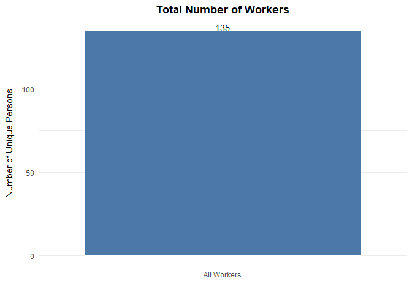<!-- -->

### Age

``` r
# Histogram Age
plot_age <- all_tables %>%
  filter(!is.na(age)) %>% 
  group_by(personid) %>% 
  summarise(age = first(age)) %>% 
  ggplot(aes(x = age)) + 
  geom_histogram(binwidth = 1, fill = "#4C78A8", color = "white") +
  labs(x = "Age", y = "Count", title = "Age Distribution") + labs(x="Age") +
  theme_minimal()

plot_age
```

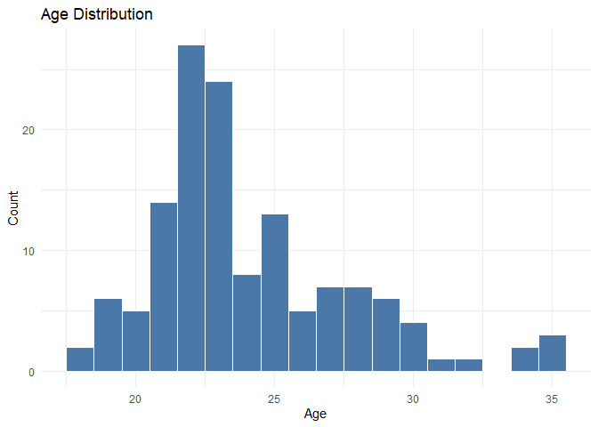<!-- -->

``` r
Age_Profile <- all_tables %>% 
  group_by(personid) %>% 
  summarize( min_age = min(age),
             max_age = max(age),
             avg_age = mean(age))

Age_Profile
```

    ## # A tibble: 135 × 4
    ##    personid min_age max_age avg_age
    ##       <dbl>   <int>   <int>   <dbl>
    ##  1     4122      NA      NA      NA
    ##  2     6278      32      32      32
    ##  3     7720      25      25      25
    ##  4     8834      NA      NA      NA
    ##  5     8854      22      22      22
    ##  6    10098      NA      NA      NA
    ##  7    10356      NA      NA      NA
    ##  8    12426      30      30      30
    ##  9    12974      NA      NA      NA
    ## 10    13980      29      29      29
    ## # ℹ 125 more rows

### Gender

``` r
plot_gender <- all_tables %>%
  filter(!is.na(gender)) %>%
  group_by(personid) %>% 
  summarise(gender = first(gender)) %>% 
  ggplot(aes(x = gender, fill = gender)) + 
  geom_bar(color = "white") +
  geom_text(stat = "count", aes(label = after_stat(count)),vjust = 0 , size = 4) +  # <- Text on top of the bar
  scale_fill_manual(values = c( female ="#4C78A8", male = "#A6CEE3")) +
  labs(x = "Gender", y = "Count", title = "Gender Distribution") + labs(x="Gender") +
  theme_minimal() +
    theme(
    plot.title = element_text(face = "bold", hjust = 0.5),
    axis.title.y = element_text(margin = margin(r = 10))
  )


plot_gender
```

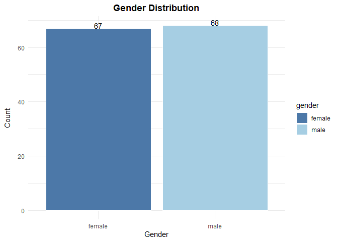<!-- -->

### Education

``` r
plot_education <- all_tables %>%
  filter(!is.na(high_educ)) %>%
  group_by(personid) %>% 
  summarise(high_educ = first(high_educ)) %>% 
  ggplot(aes(x = high_educ, fill = high_educ)) + 
  geom_bar(color = "white") +
  geom_text(stat = "count", aes(label = after_stat(count)),vjust = 0 , size = 4) +  # <- Text on top of the bar
  scale_fill_manual(values = c( "no high education" ="#4C78A8","high education"= "#A6CEE3")) +
  labs(x = "Education", y = "Count", title = "Education Distribution") + labs(x="Education") +
  theme_minimal() +
  theme(
    plot.title = element_text(face = "bold", hjust = 0.5),
    axis.title.y = element_text(margin = margin(r = 10))
  )


plot_education
```

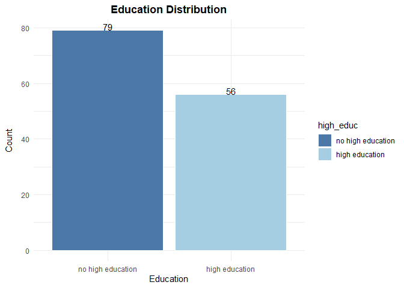<!-- -->

### Marital Status

``` r
plot_married <- all_tables %>%
  filter(!is.na(married)) %>%
  group_by(personid) %>%
  summarise(married = first(married), .groups = "drop") %>%
  ggplot(aes(x = married, fill = married)) +
  geom_bar(color = "white") +
  geom_text(
    stat = "count",
    aes(label = after_stat(count)),
    vjust = -0.3,   # slightly above the bar
    size = 4
  ) +
  scale_fill_manual(
    values = c(
      "not married" = "#4C78A8",
      "married" = "#A6CEE3"
    )
  ) +
  labs(
    x = "Marital Status",
    y = "Count",
    title = "Marital Status Distribution"
  ) +
  theme_minimal() +
  theme(
    plot.title = element_text(face = "bold", hjust = 0.5),
    axis.title.y = element_text(margin = margin(r = 10))
  )

plot_married
```

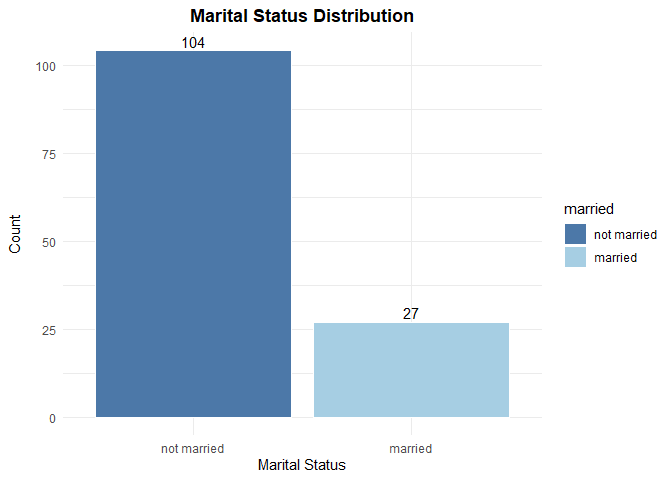<!-- -->

## Attitude

### Summary Statistics

``` r
stargazer(data.frame(attitude_labeled), type = "text"
          ,iqr = FALSE, median = TRUE, no.space = TRUE, title = "Summary Attitude")
```

    ## 
    ## Summary Attitude
    ## =============================================================
    ## Statistic    N      Mean     St. Dev.    Min   Median   Max  
    ## -------------------------------------------------------------
    ## personid   2,379 33,005.050 10,331.780  4,122  36,288  45,442
    ## exhaustion 2,379   8.612      7.794     0.000   7.000  36.000
    ## negative   2,379  -16.651     6.848    -40.000 -16.000 -8.000
    ## positive   2,379   24.215     6.668     8.000  24.000  40.000
    ## -------------------------------------------------------------

### Correlation Table

``` r
cor_matrix_attitude <- all_tables %>% 
  select(exhaustion, negative, positive) %>% 
  correlate(diagonal = 1)

# Format table for a professional presentation
cor_matrix_attitude %>%
  rearrange() %>%              # rearrange by correlations
  shave() %>%                  # Shave off the upper triangle for a clean result
  fashion(decimals = 3)        # Clean presentation
```

    ##         term exhaustion positive negative
    ## 1 exhaustion      1.000                  
    ## 2   positive      -.556    1.000         
    ## 3   negative      -.604     .451    1.000

### Attitude - Histogram

``` r
# Histogram Exhaustion
ggplot( data = all_tables, aes(x = exhaustion)) + geom_histogram( fill = "#4C78A8", color = "white") + labs(x="Exhaustion") +
  theme_minimal()
```

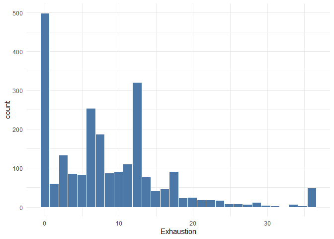<!-- -->

``` r
# Histogram negative
ggplot( data = all_tables, aes(x = negative)) + geom_histogram(fill = "#4C78A8", color = "white") + labs(x="Negative") +
  theme_minimal()
```

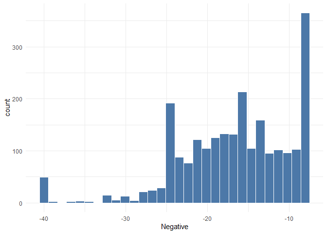<!-- -->

``` r
# Histogram positive
ggplot( data = all_tables, aes(x = positive)) + geom_histogram(fill = "#4C78A8", color = "white") + labs(x="Positive") +
  theme_minimal()
```

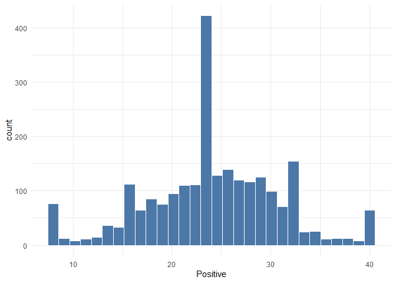<!-- -->

### Attitude - Scatterplot

``` r
# Scatterplot Exhaustion and Negative
plot.scatter_attitude_negative <-  ggplot(data = all_tables
                                          , aes(x = exhaustion, y = negative)) +
  geom_point(size = 1) +
  theme_few() +
  labs(  x = "Exhaustion"
         , y = "Negative"
         , title = "Relationship between Exhaustion and Negative") +
  theme(title = element_text(size = 8)) +
  theme_minimal()

# Add regression Line
plot.scatter_attitude_negative + stat_smooth(method = lm, colour="blue")
```

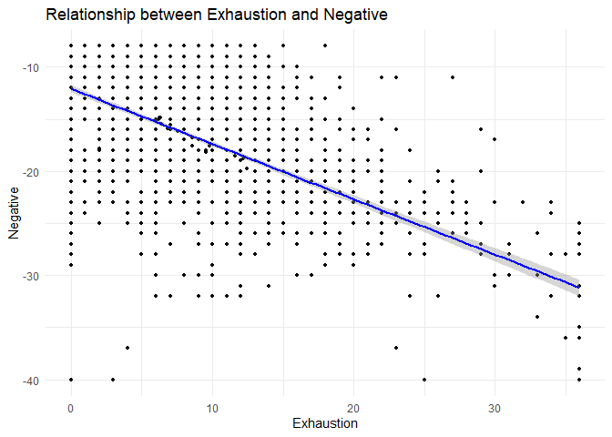<!-- -->

``` r
# Scatterplot Exhaustion and positive
plot.scatter_attitude_positive <-  ggplot(data = all_tables
                                          , aes(x = exhaustion, y = positive)) +
  geom_point(size = 1) +
  theme_few() +
  labs(  x = "Exhaustion"
         , y = "Positive"
         , title = "Relationship between Exhaustion and Positive") +
  theme(title = element_text(size = 8))

# Add regression Line
plot.scatter_attitude_positive + stat_smooth(method = lm, colour="blue") +
  theme_minimal()
```

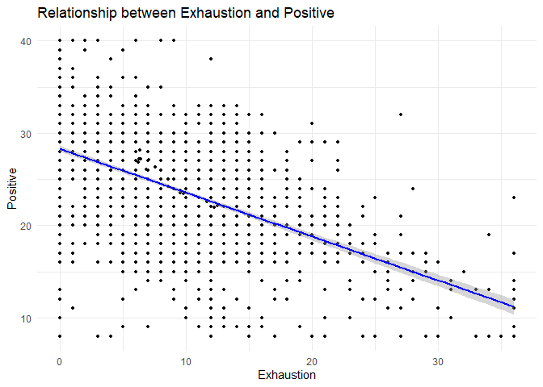<!-- -->

``` r
# Scatterplot negative and positive
plot.scatter_attitude_negative_positive <-  ggplot(data = all_tables
                                                   , aes(x = negative, y = positive)) +
  geom_point(size = 1) +
  theme_few() +
  labs(  x = "Negative"
         , y = "Positive"
         , title = "Relationship between negative and Positive") +
  theme(title = element_text(size = 8)) +
  theme_minimal()

# Add regression Line
plot.scatter_attitude_negative_positive + stat_smooth(method = lm, colour="blue")
```

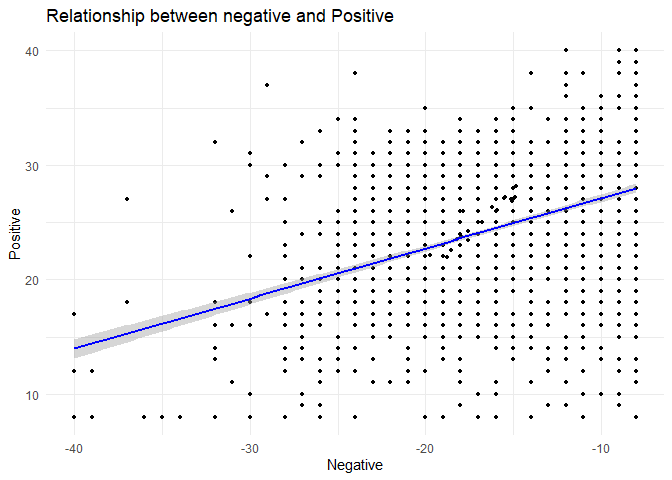<!-- -->

## Performance

``` r
summary(all_tables$perform1)
```

    ##     Min.  1st Qu.   Median     Mean  3rd Qu.     Max.     NA's 
    ## -3.03094 -0.60901  0.04601 -0.01619  0.61156  4.16331      851

### Variable Distribution

``` r
# Histogram Perform1
ggplot( data = all_tables, aes(x = perform1)) + geom_histogram(fill = "#4C78A8", color = "white") +
  labs( x = "Performance") +
  theme_minimal()
```

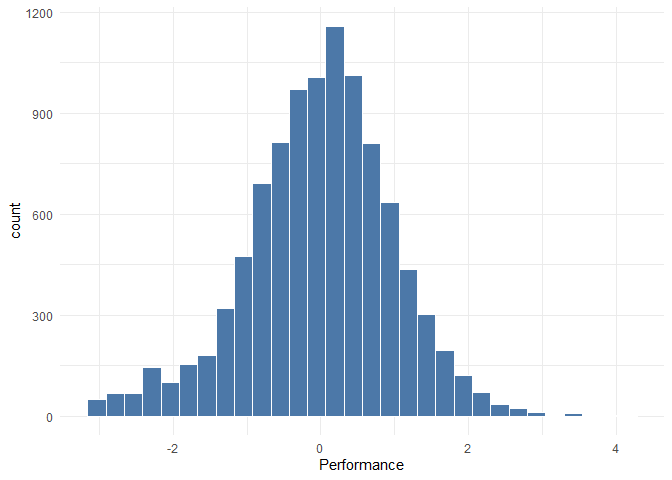<!-- -->

``` r
# check with Boxplot
ggplot(data = performance_labeled, aes(x = perform1)) + 
  geom_boxplot(fill = "#4C78A8") + 
  labs( x = "Performance") +
  scale_y_discrete() + 
  theme_minimal()
```

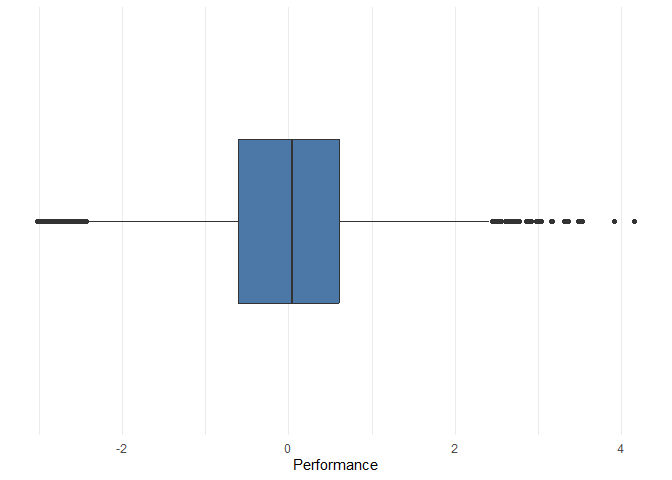<!-- -->

``` r
# some positive outliers, a lot of negative ones
```

### Summary Table

``` r
# Create Summary Table
collapse_factor <- function(x) {
  x <- x[!is.na(x)]                     # remove NAs
  if (length(x) == 0) {                 # if all missing
    return(factor(NA, levels = levels(x)))
  } else {
    return(factor(x[1], levels = levels(x)))  # keep factor type
  }
}

# Main pipeline
performance_groups_all <- all_tables %>%
  filter(!is.na(gender)) %>%            # keep only rows with valid gender
  group_by(personid) %>%
  summarise(
    avg_performance = mean(perform1, na.rm = TRUE),
    across(where(is.factor), collapse_factor),  # take one value per factor column
    .groups = "drop"
  ) %>%
  mutate(
    perf_group = case_when(
      avg_performance >= 0.5  ~ "Top performer",
      avg_performance <= -0.5 ~ "Low performer",
      TRUE                    ~ "Average performer"
    )
  )
```

### Perform / Phonecallraw

#### Variable Relationships

``` r
#Variable Relationship
# Scatterplot Perform and Phonecallraw
plot.scatter_performance_phonecallraw <-  ggplot(data = all_tables
                                    , aes(x = perform1, y = phonecallraw)) +
  geom_point(size = 1) +
  theme_few() +
  labs(  x = "Performance"
         , y = "Phonecalls"
         , title = "Relationship between Performance and Phonecalls") +
  theme(title = element_text(size = 8)) +
  theme_minimal()

# Add regression Line
plot.scatter_performance_phonecallraw + stat_smooth(method = lm, colour="blue")
```

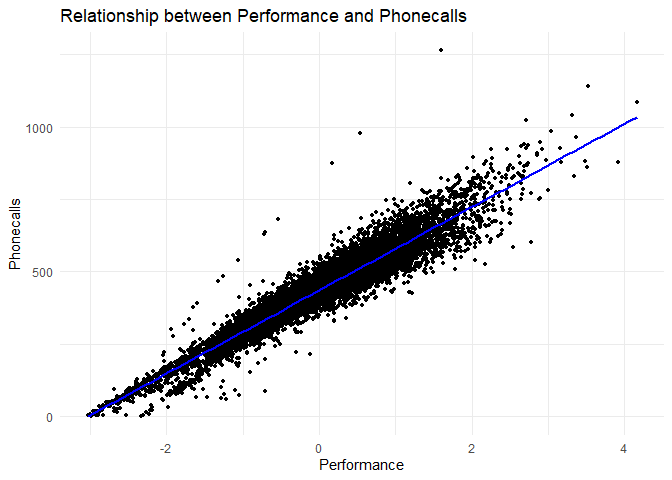<!-- -->

#### Correlation Table

``` r
cor_matrix_performance_Phonecallraw <- all_tables %>% 
  select(perform1, phonecallraw)%>% # 
  correlate(diagonal = 1)

# Format table for a professional presentation
cor_matrix_performance_Phonecallraw %>%
  rearrange() %>%              # rearrange by correlations
  shave() %>%                  # Shave off the upper triangle for a clean result
  fashion(decimals = 3)        # Clean presentation
```

    ##           term perform1 phonecallraw
    ## 1     perform1    1.000             
    ## 2 phonecallraw     .951        1.000

The correlation between performance and phone calls is almost perfect (r
= 0.95). This most likely reflects how the performance measure is
constructed, since it is largely based on call volume, rather than an
independent finding.

### Performance / Homethatweek

#### Distribution

``` r
all_tables %>%
  filter(!is.na(homethatweek), !is.na(perform1)) %>% 
  ggplot(aes(x = homethatweek, y = perform1, fill = homethatweek)) + 
  geom_boxplot() +
  stat_summary(fun = mean, geom = "point", size = 3, shape = 23) +
  labs(title = "Performance by Homethatweek"
         , x = "homethatweek"
         , y = "Performance") +
  theme_minimal()
```

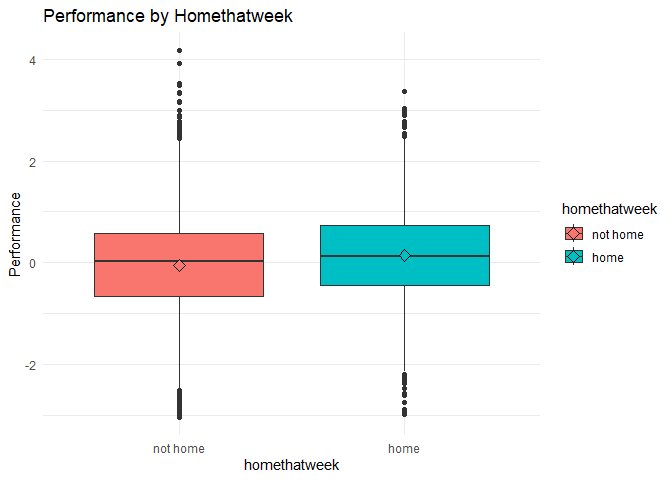<!-- -->

#### T.Test

–\> Hypothesis: H0 = “Performance” is not influenced by “homethatweek”

``` r
# t.test if the mean performance is better at home or not at home
tt_home <- t.test(perform1 ~ homethatweek, data = all_tables, alternative = "less")
tt_home
```

    ## 
    ##  Welch Two Sample t-test
    ## 
    ## data:  perform1 by homethatweek
    ## t = -8.6798, df = 3199.3, p-value < 2.2e-16
    ## alternative hypothesis: true difference in means between group not home and group home is less than 0
    ## 95 percent confidence interval:
    ##        -Inf -0.1650793
    ## sample estimates:
    ## mean in group not home     mean in group home 
    ##            -0.05625384             0.14743695

–\> Reject H0 (p = \<0.001)

Mean weekly performance: not home -0.056, home 0.147.

### Phonecalls / Homethatweek

``` r
all_tables %>%
  filter(!is.na(homethatweek), !is.na(phonecall)) %>% 
  ggplot(aes(x = homethatweek, y = phonecall, fill = homethatweek)) + 
  geom_boxplot() +
  stat_summary(fun = mean, geom = "point", size = 3, shape = 23) +
  labs(title = "Phonecall by Homethatweek"
         , x = "homethatweek"
         , y = "Phonecall") +
  theme_minimal()
```

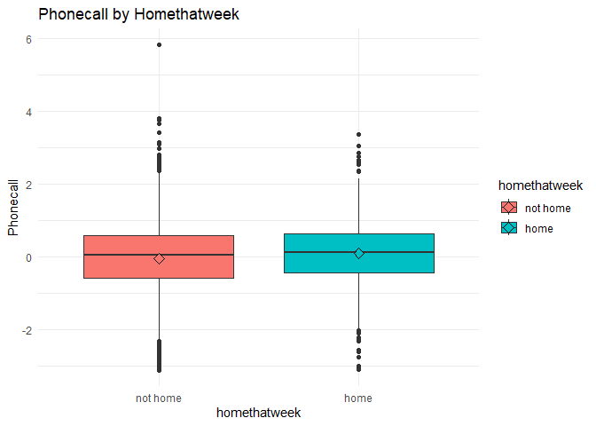<!-- -->

#### T.Test

–\> Hypothesis: H0 = “Phonecall” is not influenced by “homethatweek”

``` r
tt_calls <- t.test(phonecall ~ homethatweek, data = all_tables, alternative = "less")
tt_calls
```

    ## 
    ##  Welch Two Sample t-test
    ## 
    ## data:  phonecall by homethatweek
    ## t = -6.0467, df = 3355.5, p-value = 8.203e-10
    ## alternative hypothesis: true difference in means between group not home and group home is less than 0
    ## 95 percent confidence interval:
    ##         -Inf -0.09836697
    ## sample estimates:
    ## mean in group not home     mean in group home 
    ##            -0.03516849             0.09996936

–\> Reject H0 (p = \<0.001)

Mean weekly calls: not home -0.035, home 0.1.

### Performance / Logdaysworked

#### Correlation Table

``` r
cor_matrix_performance_logdaysworked <- all_tables %>% 
  select(perform1, logdaysworked)%>% # 
  correlate(diagonal = 1)

# Format table for a professional presentation
cor_matrix_performance_logdaysworked %>%
  rearrange() %>%              # rearrange by correlations
  shave() %>%                  # Shave off the upper triangle for a clean result
  fashion(decimals = 3)        # Clean presentation
```

    ##            term perform1 logdaysworked
    ## 1      perform1    1.000              
    ## 2 logdaysworked     .470         1.000

The correlation table shows a moderate positive correlation between
performance and logdaysworked (r = 0.47).

#### Variable Relationship - Scatter plot

``` r
# Visualization of the Correlation
plot.scatter_performance_logdaysworked <-  ggplot(data = all_tables
                                                 , aes(x = perform1, y = logdaysworked)) +
  geom_point(size = 1) +
  theme_few() +
  labs(  x = "Performance"
         , y = "Logdaysworked"
         , title = "Relationship between Performance and Days worked") +
  theme(title = element_text(size = 8)) +
  theme_minimal()

# Add regression Line
plot.scatter_performance_logdaysworked + stat_smooth(method = lm, colour="blue")
```

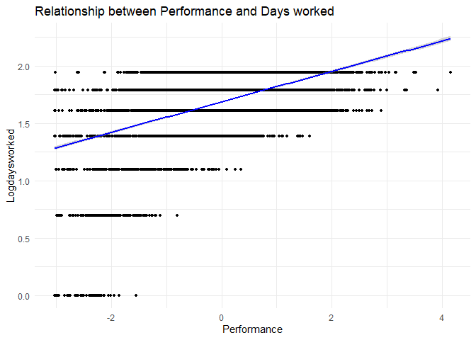<!-- -->

The scatter plot shows a positive relationship between performance and
logdaysworked.

### Performance / Exhaustion

#### Correlation Table

``` r
cor_matrix_performance_exhaustion <- all_tables %>% 
  select(perform1, exhaustion, negative, positive)%>% # 
  correlate(diagonal = 1)

# Format table for a professional presentation
cor_matrix_performance_exhaustion %>%
  rearrange() %>%              # rearrange by correlations
  shave() %>%                  # Shave off the upper triangle for a clean result
  fashion(decimals = 3)        # Clean presentation
```

    ##         term exhaustion perform1 positive negative
    ## 1 exhaustion      1.000                           
    ## 2   perform1      -.048    1.000                  
    ## 3   positive      -.556     .071    1.000         
    ## 4   negative      -.604     .044     .451    1.000

There is no real correlation between Performance and Exhaustion.

### Performance / Base Wage

#### Variable Relationship - Scatter plot

``` r
avg_df <- all_tables %>%
  group_by(year_month) %>%
  summarise(
    avg_base_wage = mean(basewage, na.rm = TRUE),
    avg_performance = mean(perform1, na.rm = TRUE)
  )


ggplot(avg_df, aes(x = avg_base_wage, y = avg_performance)) +
  geom_point(size = 3) +
  geom_smooth(method = "lm", colour="blue") +
  labs(
    title = "Average Performance vs Average Base Wage",
    subtitle = "By Year-Month",
    x = "Average Base Wage (€)",
    y = "Average Performance"
  ) +
  theme_minimal()
```

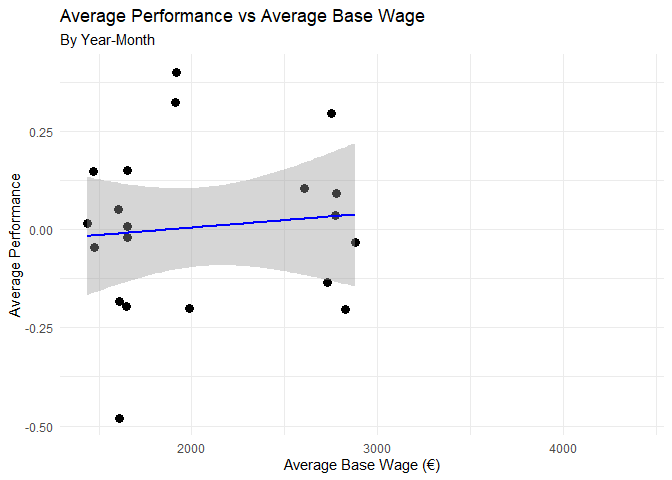<!-- -->

The scatter plot compares monthly averages. At the individual level, the
correlation between base wage and performance is close to zero (r =
-0.02), so the monthly pattern should not be read as a link between
individual pay and performance.

### Performance / Gross Wage

#### Variable Relationship - Scatter plot

``` r
avg_df <- all_tables %>%
  group_by(year_month) %>%
  summarise(
    avg_gross_wage = mean(grosswage, na.rm = TRUE),
    avg_performance = mean(perform1, na.rm = TRUE)
  )


ggplot(avg_df, aes(x = avg_gross_wage, y = avg_performance)) +
  geom_point(size = 3) +
  geom_smooth(method = "lm", colour="blue") +
  labs(
    title = "Average Performance vs Average Gross Wage",
    subtitle = "By Year-Month",
    x = "Average Gross Wage (€)",
    y = "Average Performance"
  ) +
  theme_minimal()
```

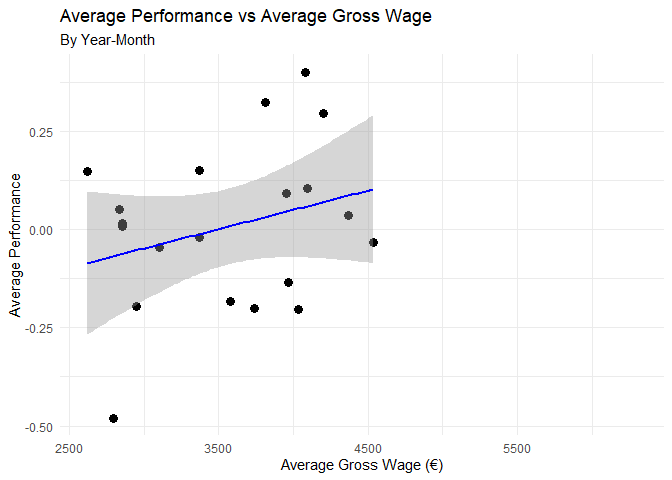<!-- -->

As with base wage, the plot shows monthly averages and does not reflect
the individual level relationship.

#### Correlation Matrix

``` r
cor_matrix_2 <- all_tables %>% 
  select(perform1, grosswage) %>% 
  correlate(diagonal = 1)

# Format table
cor_matrix_2 %>%
  rearrange() %>% 
  shave() %>% 
  fashion(decimals = 3)
```

    ##        term perform1 grosswage
    ## 1  perform1    1.000          
    ## 2 grosswage     .006     1.000

At the individual level there is practically no correlation between
performance and gross wage (r = 0.01).

### Performance / Bonus

#### Correlation

``` r
cor_matrix_performance_bonus <- all_tables %>% 
  select(perform1, basewage, grosswage, bonustotal)%>% # 
  correlate(diagonal = 1)

# Format table for a professional presentation
cor_matrix_performance_bonus %>%
  rearrange() %>%              # rearrange by correlations
  shave() %>%                  # Shave off the upper triangle for a clean result
  fashion(decimals = 3)        # Clean presentation
```

    ##         term perform1 bonustotal grosswage basewage
    ## 1   perform1    1.000                              
    ## 2 bonustotal     .250      1.000                   
    ## 3  grosswage     .006       .092     1.000         
    ## 4   basewage    -.022      -.015      .994    1.000

The correlation table shows a weak positive correlation between
performance and bonus (r = 0.25), while base and gross wage are
unrelated to performance.

#### Variable Relationship - Scatter plot

``` r
# Scatterplot Performance - Bonus
plot.scatter_performance_bonus <-  ggplot(data = all_tables
                                          , aes(x = perform1, y = bonustotal)) +
  geom_point(size = 1) +
  theme_few() +
  labs(  x = "Performance"
         , y = "Bonus"
         , title = "Relationship between Performance and Bonus") +
  theme(title = element_text(size = 8)) +
  theme_minimal()

# Add regression Line
plot.scatter_performance_bonus + stat_smooth(method = lm, colour="blue")
```

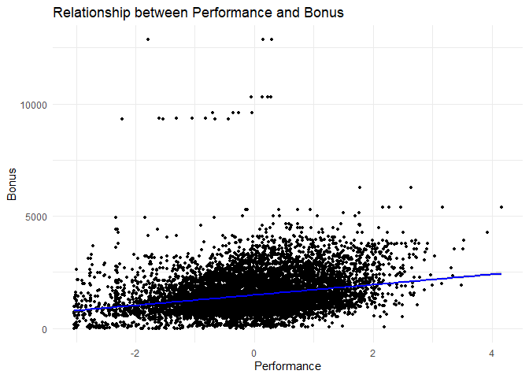<!-- -->

The scatter plot confirms the weak positive relationship between bonus
and performance.

### Performance / Age

#### Correlation Table

``` r
cor_matrix_performance_age <- all_tables %>% 
  select(perform1, age)%>% # 
  correlate(diagonal = 1)

# Format table for a professional presentation
cor_matrix_performance_age %>%
  rearrange() %>%              # rearrange by correlations
  shave() %>%                  # Shave off the upper triangle for a clean result
  fashion(decimals = 3)        # Clean presentation
```

    ##       term perform1   age
    ## 1 perform1    1.000      
    ## 2      age     .075 1.000

–\> Only a very weak correlation between performance and age (r = 0.08).

#### Variable Relationship - Scatter plot

``` r
plot.scatter_performance_age_mean <-  ggplot(data = Mean_Personid
                                             , aes(x = mean_perform1, y = mean_age)) +
  geom_point(size = 1) +
  theme_few() +
  labs(  x = "Performance"
         , y = "age"
         , title = "Relationship between Performance and age") +
  theme(title = element_text(size = 8)) +
  theme_minimal()

# Add regression Line
plot.scatter_performance_age_mean + stat_smooth(method = lm, colour="blue")
```

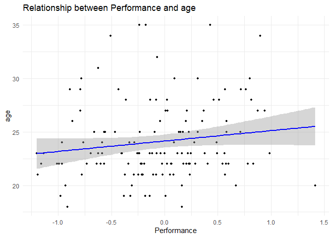<!-- -->

**Home Performance vs. Age**

``` r
# Bar chart Performance by Age (home weeks only)
# 1) Prepare data: filter home only, valid age & performance
df_home <- all_tables %>%
  filter(homethatweek == "home",
         !is.na(age),
         !is.na(perform1))

df_summary <- df_home %>%
  mutate(age_group = age) %>%
  group_by(age_group) %>%
  summarise(
    n = dplyr::n(),
    mean_performance = mean(perform1, na.rm = TRUE),
    sd = sd(perform1, na.rm = TRUE),
    se = sd / sqrt(n),
    ci95 = 1.96 * se,
    .groups = "drop"
  )


ggplot(df_summary, aes(x = age_group, y = mean_performance)) +
  geom_col(fill = "steelblue", color = "white") +
  labs(
    title = "Average Performance by Age Group (Home Only)",
    x = "Age Group",
    y = "Average Performance (perform1)"
  ) +
  theme_minimal() +
  theme(axis.text.x = element_text(angle =45,hjust=1))
```

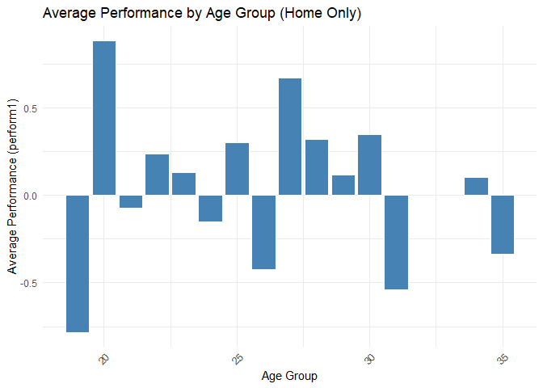<!-- -->

The chart shows average performance in work-from-home weeks for each
age.

### Performance / Quit

#### Variable Relationship - Box plot

``` r
all_tables %>% 
filter(!is.na(quitjob), !is.na(perform1)) %>%
  ggplot(aes(x = quitjob, y = perform1, fill = quitjob)) +
  geom_boxplot() +
    stat_summary(fun = mean, geom = "point", size = 3, shape = 23) +
  labs(
    title = "Performance by Quit Status",
    x = "Quit Status",
    y = "Performance Score"
  ) +
  theme_minimal()
```

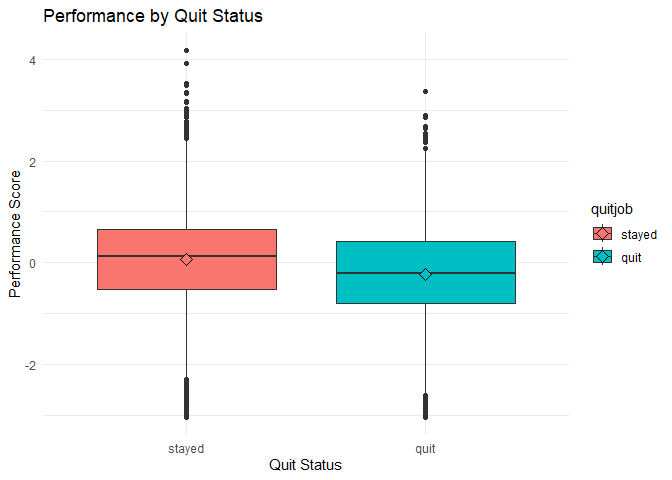<!-- -->

#### T.Test

–\> Hypothesis: H0 = Employees who quit and employees who stayed have
the same average performance

``` r
tt_quit <- t.test(avg_performance ~ quitjob, data = person_level)
tt_quit
```

    ## 
    ##  Welch Two Sample t-test
    ## 
    ## data:  avg_performance by quitjob
    ## t = 3.1031, df = 76.957, p-value = 0.002678
    ## alternative hypothesis: true difference in means between group stayed and group quit is not equal to 0
    ## 95 percent confidence interval:
    ##  0.1074846 0.4924819
    ## sample estimates:
    ## mean in group stayed   mean in group quit 
    ##           0.02450151          -0.27548170

–\> Reject H0 (p = 0.00268)

Mean performance: stayed 0.025, quit -0.275.

**Bar chart showing number of people by Quit status and performance
group**

``` r
performance_groups_all %>%
  ggplot(aes(x = perf_group, fill = quitjob)) +
  geom_bar(position = "dodge") +
  labs(
    title = "Distribution of Performance Groups by Quit Status",
    x = "Performance Group",
    y = "Number of Employees"
  ) +
  theme_minimal()
```

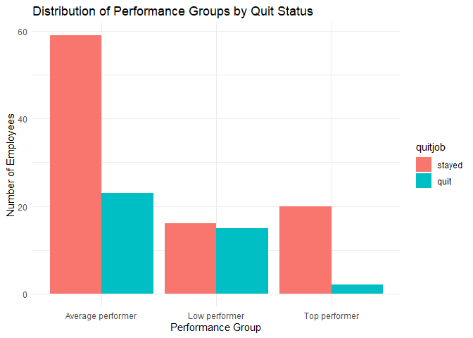<!-- -->

### Performance / Promotion

#### Variable Relationship - Box plot

``` r
all_tables %>%
  filter(!is.na(promote_switch), !is.na(perform1)) %>%
  ggplot(aes(x = promote_switch, y = perform1, fill = promote_switch)) +
  geom_boxplot() +
  stat_summary(fun = mean, geom = "point", size = 3, shape = 23) +
  labs(
    title = "Performance by Promotion Status",
    x = "Promotion Status",
    y = "Performance Score"
  ) +
  theme_minimal()
```

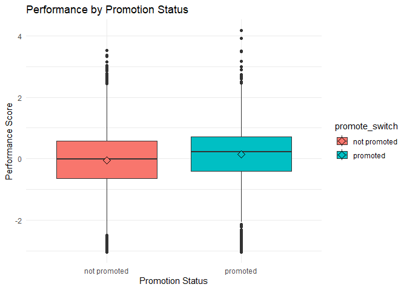<!-- -->

#### T.Test

–\> Hypothesis: H0 = Promoted and not promoted employees have the same
average performance

``` r
tt_promo <- t.test(avg_performance ~ promote_switch, data = person_level)
tt_promo
```

    ## 
    ##  Welch Two Sample t-test
    ## 
    ## data:  avg_performance by promote_switch
    ## t = -2.0923, df = 30.741, p-value = 0.04477
    ## alternative hypothesis: true difference in means between group not promoted and group promoted is not equal to 0
    ## 95 percent confidence interval:
    ##  -0.496730650 -0.006260531
    ## sample estimates:
    ## mean in group not promoted     mean in group promoted 
    ##                 -0.1053669                  0.1461287

–\> Reject H0 (p = 0.0448)

Mean performance: not promoted -0.105, promoted 0.146.

**Bar chart showing number of people by promotion status and performance
group**

``` r
performance_groups_all %>%
  ggplot(aes(x = perf_group, fill = promote_switch)) +
  geom_bar(position = "dodge") +
  labs(
    title = "Distribution of Performance Groups by Promotion Status",
    x = "Performance Group",
    y = "Number of Employees"
  ) +
  theme_minimal()
```

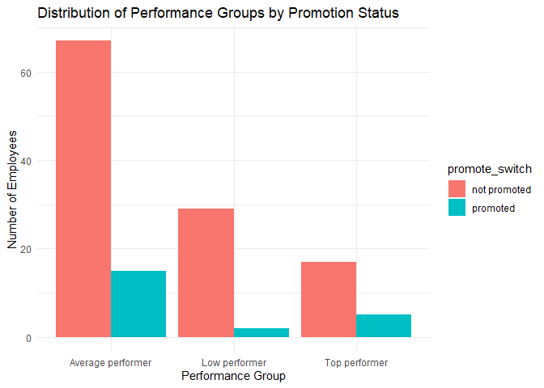<!-- -->

### Performance / Education

#### Variable Relationship - Box plot

``` r
all_tables %>% 
  filter(!is.na(high_educ), !is.na(perform1)) %>% 
  group_by(personid) %>% 
  ggplot(aes(x = high_educ, y = perform1, fill = high_educ)) + 
  geom_boxplot() +
  stat_summary(fun = mean, geom = "point", size = 3, shape = 23) +
  labs(
    title = "Performance by Education",
    x = "Education",
    y = "Performance Score"
  ) +
  theme_minimal()
```

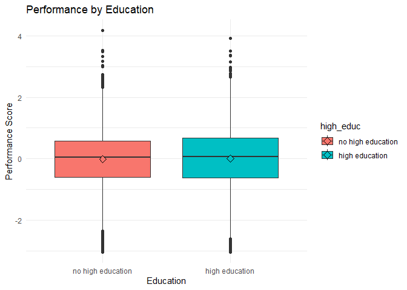<!-- -->

#### T.Test

–\> Hypothesis: H0 = Employees with and without high education have the
same average performance

``` r
tt_educ <- t.test(avg_performance ~ high_educ, data = person_level)
tt_educ
```

    ## 
    ##  Welch Two Sample t-test
    ## 
    ## data:  avg_performance by high_educ
    ## t = -0.14529, df = 117.08, p-value = 0.8847
    ## alternative hypothesis: true difference in means between group no high education and group high education is not equal to 0
    ## 95 percent confidence interval:
    ##  -0.2018620  0.1742683
    ## sample estimates:
    ## mean in group no high education    mean in group high education 
    ##                     -0.07010553                     -0.05630871

–\> Fail to reject H0 (p = 0.885)

Mean performance: no high education -0.07, high education -0.056.

**Bar chart showing number of people by Education and performance
group**

``` r
performance_groups_all %>%
  ggplot(aes(x = perf_group, fill = high_educ)) +
  geom_bar(position = "dodge") +
  labs(
    title = "Distribution of Performance Groups by Education",
    x = "Performance Group",
    y = "Number of Employees"
  ) +
  theme_minimal()
```

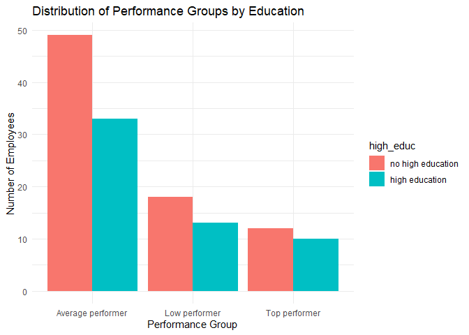<!-- -->

### Performance / Tenure

#### Variable Relationship - Scatter plot

``` r
all_tables %>%
  filter(!is.na(tenure), !is.na(perform1)) %>%
  ggplot(aes(x = tenure, y = perform1)) +
  geom_point(alpha = 0.4) +        # scatter points
  geom_smooth(method = "lm", se = TRUE, color = "blue") +  # regression line
  labs(
    title = "Relationship between Tenure and Performance",
    x = "Tenure (months)",
    y = "Performance Score"
  ) +
  theme_minimal()
```

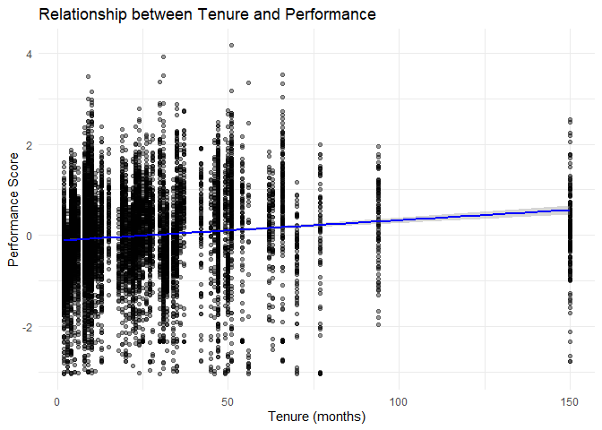<!-- -->

The scatter plot shows a very weak positive relationship between tenure
and performance (r = 0.11).

### Performance / Gender

#### Variable Relationship - Box plot

``` r
all_tables %>%
  filter(!is.na(gender), !is.na(perform1)) %>%
  ggplot(aes(x = gender, y = perform1, fill = gender)) +
  geom_boxplot() +
  stat_summary(fun = mean, geom = "point", size = 3, shape = 23) +
  labs(
    title = "Performance by Gender",
    x = "Gender",
    y = "Performance Score"
  ) +
  theme_minimal()
```

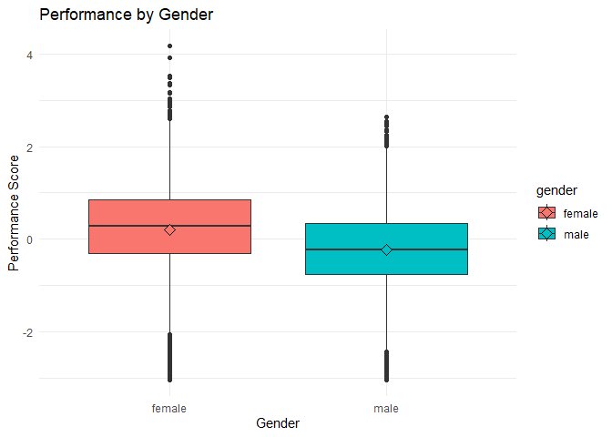<!-- -->

#### T.Test

–\> Hypothesis: H0 = Female and male employees have the same average
performance

``` r
tt_gender <- t.test(avg_performance ~ gender, data = person_level)
tt_gender
```

    ## 
    ##  Welch Two Sample t-test
    ## 
    ## data:  avg_performance by gender
    ## t = 5.0925, df = 131.4, p-value = 1.198e-06
    ## alternative hypothesis: true difference in means between group female and group male is not equal to 0
    ## 95 percent confidence interval:
    ##  0.2654664 0.6027065
    ## sample estimates:
    ## mean in group female   mean in group male 
    ##            0.1542685           -0.2798179

–\> Reject H0 (p = \<0.001)

Mean performance: female 0.154, male -0.28.

#### Performance / Gender

**Bar chart showing number of people by gender and performance group**

``` r
performance_groups_all %>%
  ggplot(aes(x = perf_group, fill = gender)) +
  geom_bar(position = "dodge") +
  labs(
    title = "Distribution of Performance Groups by Gender",
    x = "Performance Group",
    y = "Number of Employees"
  ) +
  theme_minimal()
```

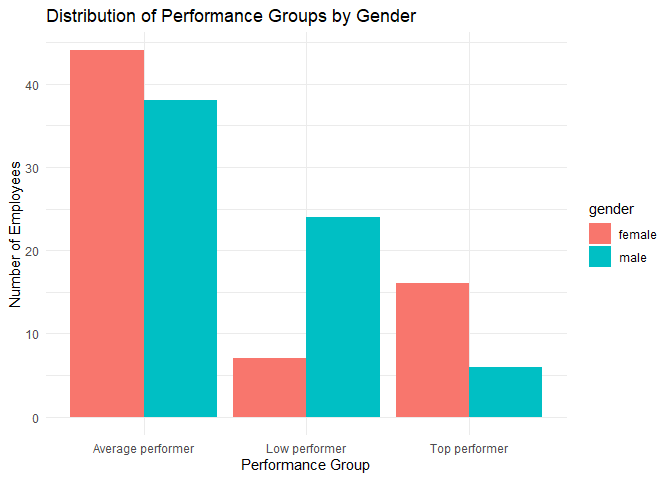<!-- -->

The chart compares the number of female and male employees in each
performance group.

### Performance Overview

#### Correlation Table

``` r
# Select numerical variables
Performance_numeric_var <- all_tables %>% 
  select(perform1, phonecallraw, logdaysworked, exhaustion, basewage, grosswage, bonustotal, age, tenure)

# Correlation Table between numerical variables
correlation_matrix_performance <- correlate(Performance_numeric_var, diagonal = 1)

# Print Table
correlation_matrix_performance %>%
  rearrange() %>%              # rearrange by correlations
  shave() %>%                  # Shave off the upper triangle for a clean result
  fashion(decimals = 3)        # Clean presentation
```

    ##            term perform1 phonecallraw logdaysworked bonustotal tenure   age
    ## 1      perform1    1.000                                                   
    ## 2  phonecallraw     .951        1.000                                      
    ## 3 logdaysworked     .470         .452         1.000                        
    ## 4    bonustotal     .250         .284          .195      1.000             
    ## 5        tenure     .114         .158         -.034       .187  1.000      
    ## 6           age     .075         .081         -.020       .163   .597 1.000
    ## 7    exhaustion    -.048        -.003          .021       .001   .034 -.052
    ## 8     grosswage     .006         .009          .022       .092  -.005  .004
    ## 9      basewage    -.022        -.022          .001      -.015  -.025 -.014
    ##   exhaustion grosswage basewage
    ## 1                              
    ## 2                              
    ## 3                              
    ## 4                              
    ## 5                              
    ## 6                              
    ## 7      1.000                   
    ## 8       .037     1.000         
    ## 9       .038      .994    1.000

``` r
# Visualize the correlation matrix
ggcorr(Performance_numeric_var,
       label = TRUE,
       method = c("everything", "pearson"),
       low = "blue", mid = "white", high = "red",
       layout.exp = 2,          # increases the distance from text to matrix
       label_size = 3,
       hjust = 0.9, vjust = 0.9)
```

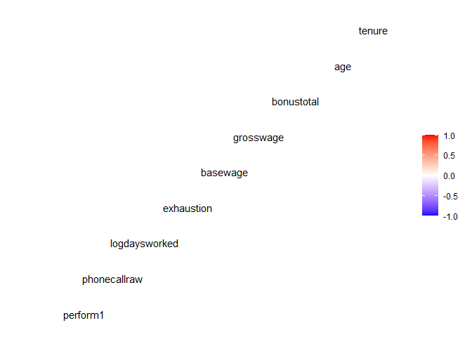<!-- -->

The correlation matrix shows:

- a very strong correlation between performance and phone calls (r =
  0.95), which reflects how performance is measured
- a moderate positive correlation with days worked (r = 0.47)
- a weak positive correlation with bonus (r = 0.25)
- no meaningful correlation with exhaustion, base wage, gross wage, age
  or tenure (all \|r\| ≤ 0.11)

## Endperiod

### Cost of Commute

#### Variable Distribution - Histogram

``` r
ggplot(all_tables, aes(x = costofcommute)) +
  geom_histogram(
    binwidth = 5,                      # adjust bins to your data scale
    fill = "#4C78A8",
    color = "white",                    # clean bin borders
  ) +
  labs(
    title = "Distribution of Monthly Commute Cost",
    x = "Monthly Commute Cost",
    y = "Number of Employees"
  ) +
  theme_minimal(base_size = 13)
```

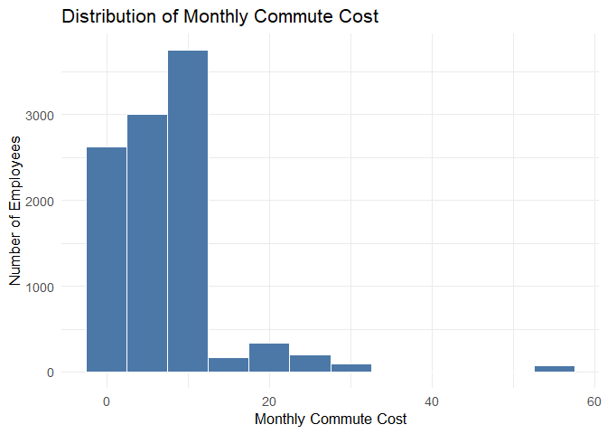<!-- -->

#### Variable Distribution - Boxplot

``` r
ggplot(data = all_tables, aes(x = costofcommute)) + 
  geom_boxplot( fill ="#4C78A8") + 
  scale_y_discrete() +
  theme_minimal()
```

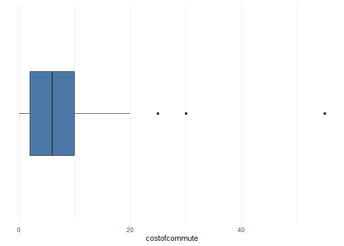<!-- -->

### Cost of Commute / Commute (Time)

#### Variable Relationships - Scatter plot

``` r
all_tables %>%
  filter(!is.na(commute), !is.na(costofcommute)) %>%
  ggplot(aes(x = commute, y = costofcommute)) +
  geom_point(alpha = 0.4) +        # scatter points
  geom_smooth(method = "lm", se = TRUE, color = "blue") +  # regression line
  labs(
    title = "Relationship between Commute time and Cost of commute",
    x = "commute (minutes)",
    y = "Cost of commute"
  ) +
  theme_minimal()
```

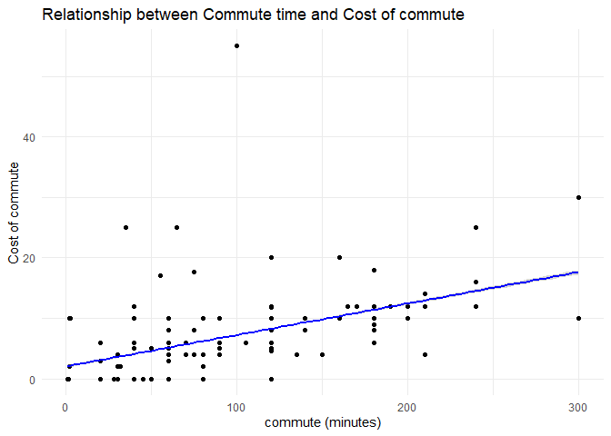<!-- -->

Scatter plot shows that there is a correlation between Cost of commute
and commute (minutes).

### Cost of Commute / Quit Job

#### Descriptive Statistics

``` r
all_tables %>% 
  filter(!is.na(quitjob), !is.na(costofcommute)) %>% 
  group_by(personid) %>% 
  ggplot(aes(x = quitjob, y = costofcommute, fill = quitjob)) + 
  geom_boxplot() +
  labs(
    title = "Cost of Commute by Quit Status",
    x = "Quit Status",
    y = "Cost of Commute"
  ) +
  theme_minimal()
```

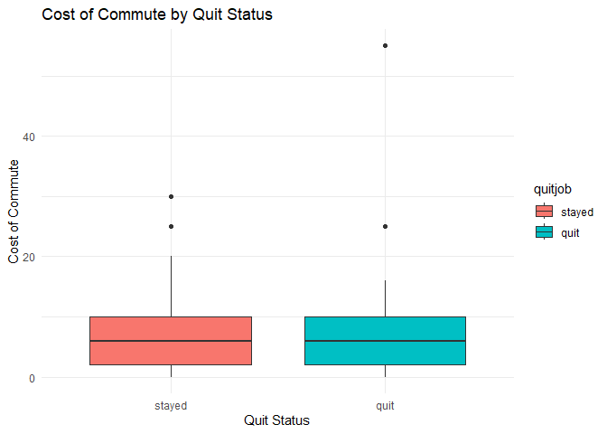<!-- -->

#### T.Test

–\> Hypothesis: H0 = Employees who quit and employees who stayed have
the same average commute cost

``` r
tt_commute <- t.test(costofcommute ~ quitjob, data = person_level)
tt_commute
```

    ## 
    ##  Welch Two Sample t-test
    ## 
    ## data:  costofcommute by quitjob
    ## t = -1.0928, df = 52.635, p-value = 0.2794
    ## alternative hypothesis: true difference in means between group stayed and group quit is not equal to 0
    ## 95 percent confidence interval:
    ##  -5.066774  1.493167
    ## sample estimates:
    ## mean in group stayed   mean in group quit 
    ##             6.876833             8.663636

–\> Fail to reject H0 (p = 0.279)

Mean monthly commute cost: stayed 6.88, quit 8.66.

### Cost of Commute / Exhaustion

#### Variable Relationships - Scatter plot

``` r
ggplot(all_tables, aes(x = costofcommute, y = exhaustion)) +
  geom_point(alpha = 0.5) +
  geom_smooth(method = "lm", se = FALSE) +
  labs(title = "Cost of Commute vs Exhaustion", x = "Cost of Commute", y = "Exhaustion") +
  theme_minimal()
```

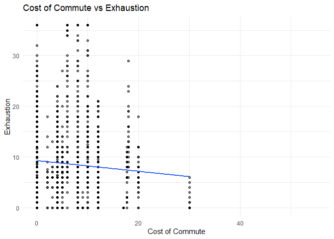<!-- -->

The scatter plot shows a slight negative correlation.

## Volunteer

### Tenure

#### Tenure / Married

##### Variable Relationship - Box plot

``` r
ggplot(summary_volunteer_labeled %>% drop_na(married, tenure),
       aes(x = married, y = tenure, fill = married)) +
  geom_boxplot(outlier.alpha = 0.25) +
  stat_summary(fun = mean, geom = "point", size = 3, shape = 23) +
  labs(title = "Tenure by Marital Status", x = "Marital status", y = "Tenure (months)") +
  theme_minimal()
```

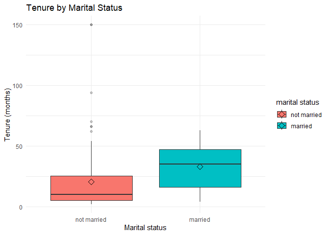<!-- -->

##### T.Test

–\> Hypothesis: H0 = Married and not married employees have the same
average tenure

``` r
tt_tenure_married <- t.test(tenure ~ married, data = person_level)
tt_tenure_married
```

    ## 
    ##  Welch Two Sample t-test
    ## 
    ## data:  tenure by married
    ## t = -2.891, df = 55.679, p-value = 0.005467
    ## alternative hypothesis: true difference in means between group not married and group married is not equal to 0
    ## 95 percent confidence interval:
    ##  -20.928230  -3.794705
    ## sample estimates:
    ## mean in group not married     mean in group married 
    ##                  20.49038                  32.85185

–\> Reject H0 (p = 0.00547)

Mean tenure in months: not married 20.5, married 32.9.

#### Age / Married

##### Variable Relationship - Box plot

``` r
ggplot(summary_volunteer_labeled %>% drop_na(married, age),
       aes(x = married, y = age, fill = married)) +
  geom_boxplot(outlier.alpha = 0.25) +
  stat_summary(fun = mean, geom = "point", size = 3, shape = 23) +
  labs(title = "Age by Marital Status", x = "Marital status", y = "Age (years)") +
  theme_minimal()
```

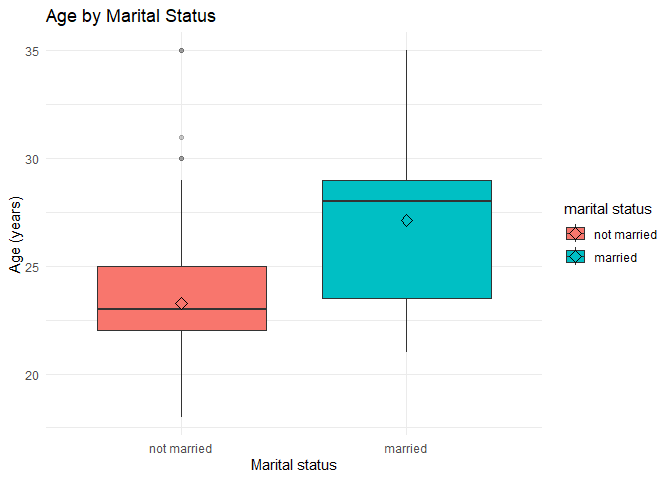<!-- -->

##### T.Test

–\> Hypothesis: H0 = Married and not married employees have the same
average age

``` r
tt_age_married <- t.test(age ~ married, data = person_level)
tt_age_married
```

    ## 
    ##  Welch Two Sample t-test
    ## 
    ## data:  age by married
    ## t = -4.9491, df = 35.839, p-value = 1.773e-05
    ## alternative hypothesis: true difference in means between group not married and group married is not equal to 0
    ## 95 percent confidence interval:
    ##  -5.430048 -2.272943
    ## sample estimates:
    ## mean in group not married     mean in group married 
    ##                  23.25962                  27.11111

–\> Reject H0 (p = \<0.001)

Mean age: not married 23.3, married 27.1.

#### Tenure / Age

##### Variable Relationship - Scatter plot

``` r
ggplot(all_tables, aes(x = tenure, y = age)) +
  geom_point(alpha = 0.5) +
  geom_smooth(method = "lm", se = FALSE) +
  labs(title = "Relationship between Tenure and Age", x = "Tenure (months)", y = "Age") +
  theme_minimal()
```

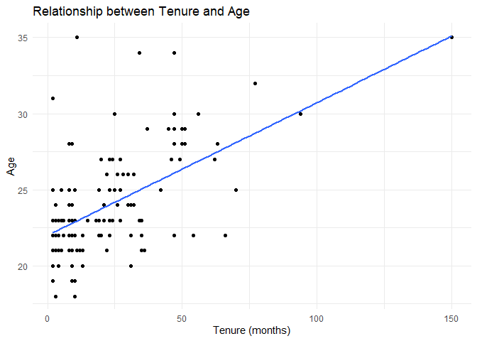<!-- -->

The scatter plot shows a very high correlation between Tenure and Age.

Since tenure and age are closely related, differences in tenure by
marital status may largely reflect differences in age.

#### Tenure / Exhaustion

##### Variable Relationship - Scatter plot

``` r
ggplot(all_tables, aes(x = tenure, y = exhaustion)) +
  geom_point(alpha = 0.5) +
  geom_smooth(method = "lm", se = FALSE) +
  labs(title = "Tenure vs Exhaustion", x = "Tenure (months)", y = "Exhaustion") +
  theme_minimal()
```

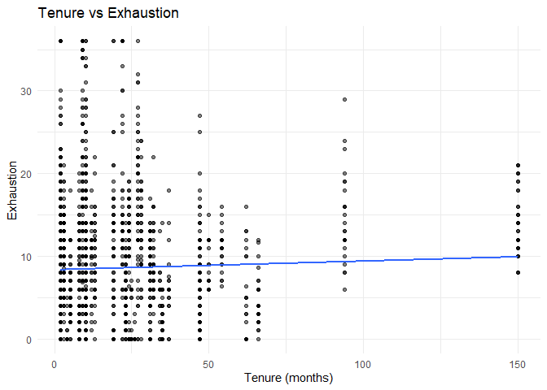<!-- -->

This Plot shows that there only is a slight correlation between
Exhaustion and Tenure.

#### Tenure / Promotion

##### Variable Relationship - Box plot

``` r
ggplot(person_level %>% drop_na(promote_switch, tenure),aes(x = promote_switch, y = tenure, fill = promote_switch)) +
  geom_boxplot(outlier.alpha = 0.25) +
  stat_summary(fun = mean, geom = "point", size = 3, shape = 23) +
  labs(title = "Tenure by Promotion Status", x = "Promotion Status", y = "Tenure (months)") +
  theme_minimal()
```

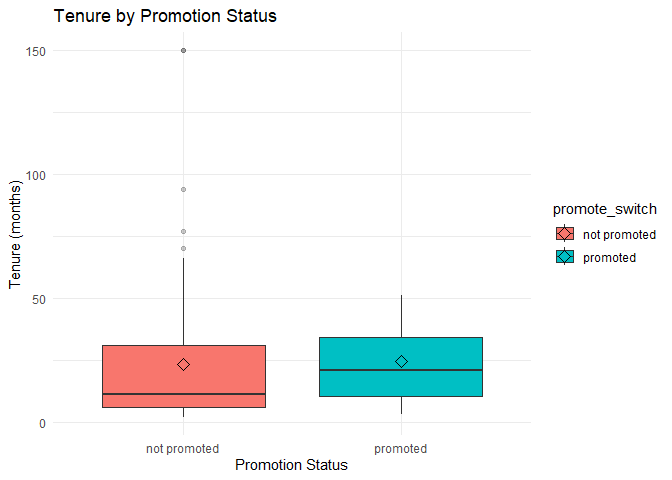<!-- -->

#### T.Test

–\> Hypothesis: H0 = Promoted and not promoted employees have the same
average tenure

``` r
tt_tenure_promo <- t.test(tenure ~ promote_switch, data = person_level)
tt_tenure_promo
```

    ## 
    ##  Welch Two Sample t-test
    ## 
    ## data:  tenure by promote_switch
    ## t = -0.34367, df = 46.008, p-value = 0.7327
    ## alternative hypothesis: true difference in means between group not promoted and group promoted is not equal to 0
    ## 95 percent confidence interval:
    ##  -9.877424  6.996491
    ## sample estimates:
    ## mean in group not promoted     mean in group promoted 
    ##                   23.15044                   24.59091

–\> Fail to reject H0 (p = 0.733)

Mean tenure in months: not promoted 23.2, promoted 24.6.
